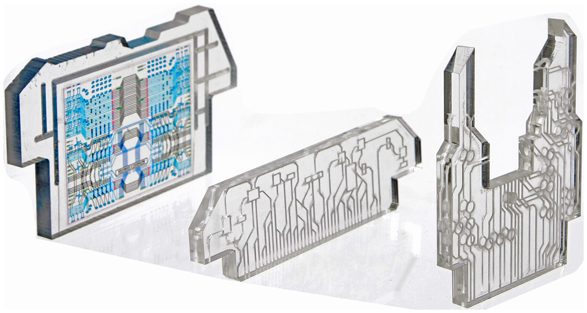
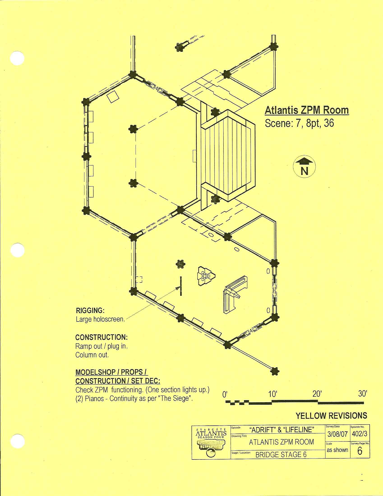
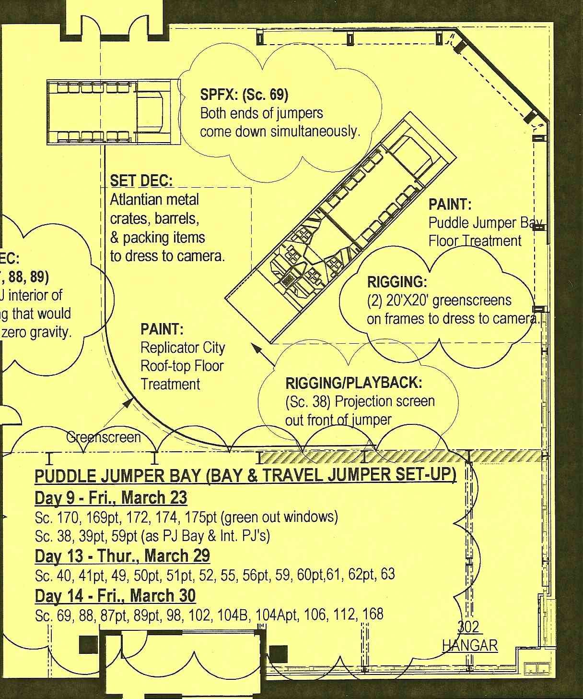
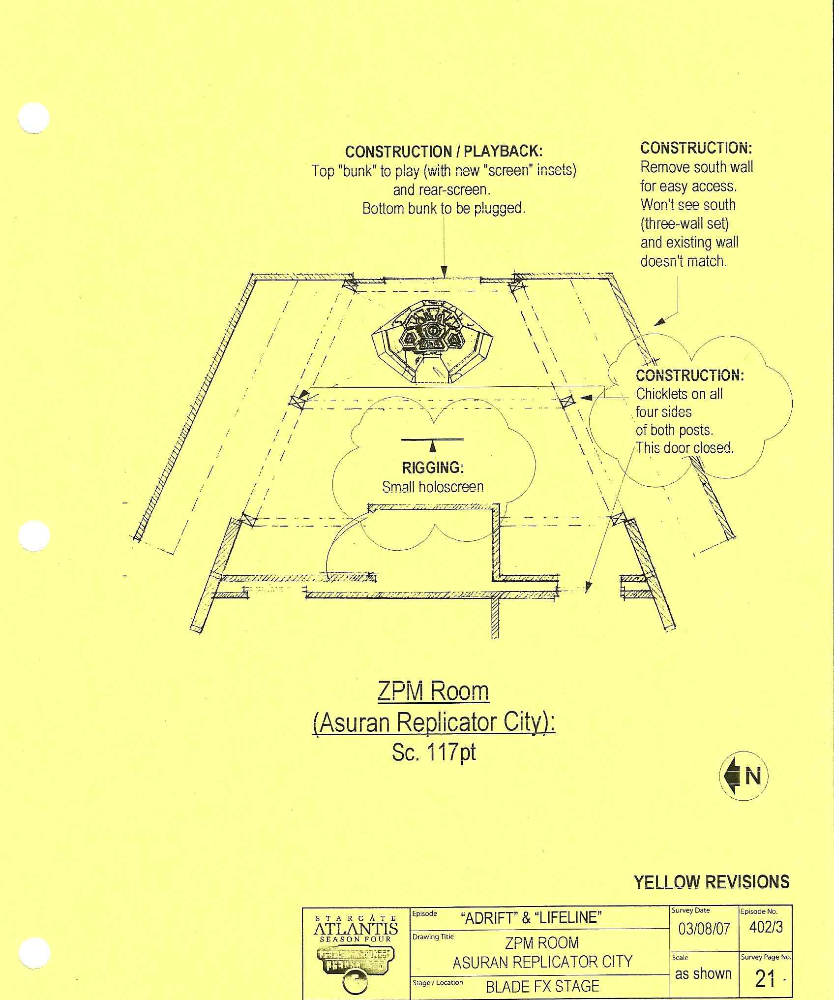

# STARGATE ATLANTIS: TECHNICAL MANUAL

**ATLANTIS EXPEDITION ENGINEERING REFERENCE**

*Prepared in the tradition of the Star Trek Writers'/DS9 Technical Manuals: an in-universe reference consolidating broadcast canon, with clearly marked engineering extrapolation.*

---

## ABOUT THIS DOCUMENT

This manual provides the detailed technical background that stories set aboard Atlantis and across the Pegasus Galaxy sometimes need. It is a supplement to, not a replacement for, character and drama. As Gene Roddenberry said of phasers: when a soldier picks up a P-90, he does not explain how it works. The audience only needs to see it work. This manual exists so that *when* technology becomes the story, the story stays internally consistent.

**Edition pin.** This Second Edition reflects the expedition's status quo as of **2008 CE, following the return of the city from Earth and the destruction of the Super-Hive above it** (see §1.5). Events after that point are not reflected here.

**Conventions used throughout:**

| Marker | Meaning |
|---|---|
| *(no marker)* | Established by on-screen canon as broadcast |
| **[E]** | Extrapolation — internally consistent engineering detail where the screen was silent. May be refined, never casually contradicted |
| **[W]** | Writer's latitude note — guidance on how hard this rule binds you |

Where this manual conflicts with a filmed episode, the episode wins. Log the conflict in Appendix C.

**Structure:** Part One sets the strategic theater and the current status quo. Part Two is the city of Atlantis itself (the heart of the show). Parts Three–Five cover gate operations, vessels, and weapons. Part Six is the threat dossier, read it before writing any Wraith, Asuran, or Genii scene. Part Seven defines command structure. Part Eight catalogs the galaxy's hazards and phenomena, the springboard section. Appendices carry glossary, conversions, the canon log, and index.

---

## PART ONE: THE PEGASUS THEATER

### 1.0 Introduction

The Atlantis Expedition is humanity's first permanent intergalactic colony: a city of ten million years, crewed by a few hundred people from Earth, operating at the far end of a one-way gate connection, surrounded by civilizations older, hungrier, and better armed than themselves. Every technical system in this manual should be read through that lens, magnificent, half-understood, and irreplaceable.

**In brief:** The expedition does not build its technology; it inherits, repairs, and reverse-engineers it. Scarcity, of power, of parts, of Ancient expertise, is the engine of both plot and procedure.

### 1.1 The Strategic Situation

| Property | Value |
|---|---|
| Theater | Pegasus Dwarf Irregular Galaxy |
| Distance from Earth | ~3,000,000 light-years |
| Gate network density | Extremely high; Ancients gated nearly every human-habitable world |
| Expedition posture | Fortified research colony; technologically outmatched but holding superior defensive ground |

Pegasus is small, roughly 6,000 light-years across **[E]**, about one-fifteenth the Milky Way's span, and dense. The Ancients seeded human populations across it deliberately ("we spread them on many worlds"), both as settlers and, after the Iratus hybridization catastrophe, as a managed second food supply for the Wraith. The result two million years later is a galaxy of pre-industrial human worlds under a shared trauma: the Culling.

Three facts define every strategic decision:

1. **The gate network is total.** Any world can reach any other in seconds. There are no meaningful borders, only patrol patterns.
2. **Power is everything.** Wraith fleets hibernate between cullings because feeding grounds deplete. Asurans sit on an entire ZPM manufacturing capability they are code-forbidden to use against humans. Whoever holds zero-point modules holds the initiative.
3. **Atlantis is unique.** No second city-ship is known to survive intact. Loss of the city is loss of the expedition's entire industrial base.

**[W]** The compressed geography is deliberate: no location is more than days apart by hyperspace, so any two plots can plausibly touch.

### 1.2 Consolidated Timeline

| Era | Event |
|---|---|
| ~10,000,000 years ago | Plague ravages the Ancients in the Milky Way. Survivors depart; Atlantis leaves Earth for Pegasus carrying the city's founding population |
| ~10,000,000 – 100,000 years ago **[E]** | Lantean expansion. Gate network seeded; human populations transplanted across Pegasus |
| ~100,000 years ago **[E]** | Iratus bug–human hybridization produces the proto-Wraith in the galactic south |
| ~10,000 years ago | Lantean–Wraith War ends. Despite technological supremacy (drones, Aurora-class fleet, the Attero device), the Lanteans lose to attrition and withdraw to Atlantis. The city sinks beneath the ocean of Lantea under cloak, one ZPM on trickle discharge, its population evacuated to Earth via the gate |
| 10,000 – 200 years ago | Wraith dominance and hibernation cycles. Human cultures rebuild between cullings; Athosian oral history preserves the pattern precisely enough to predict them |
| 2004 CE | International covert expedition dials Earth's Stargate eight chevrons to Pegasus. Shield failure floods lower districts; automatic systems raise the city. First contact with the Wraith within weeks |
| 2004–2008+ | Siege of Atlantis; ZPM economy of scarcity; Asuran war and Replicator destruction; alliance with Travelers and Todd's hive; city relocated once, then returned; battle of the Super-Hive above Earth |

### 1.3 Technological Assessment of Major Powers

*(Format follows the DS9 Technical Manual's threat assessment convention. Full dossiers in Part Six.)*

**The Wraith.** Biotechnology grown rather than built. Ships are alive; hulls regenerate; power plants metabolize human life-force. Technologically superior to Earth in drive performance and hull survivability, inferior in energy weapons discipline, Wraith doctrine is swarm and board, not duel. Their decisive weapon is time: they can always wait out a hibernation cycle, and their enemies cannot.

**The Asurans.** Nanite-based replicators built by the Ancients as anti-Wraith weapons, then suppressed by a hardcoded aggression directive ("you will not attack the Wraith... or interact with humans"). They possess full Lantean-era technology including ZPM manufacture. Politically schismatic: a mainstream collective obsessed with "Ascension" purity, and exiled code-deviants. Destroyed as a civilization during the Asuran war; remnant nanites remain a standing contamination hazard.

**The Genii.** A human culture that survived the Cullings by going underground, literally. Industrial-age surface, nuclear-age core. Their technology is 1950s-equivalent with crude naquadah refinement and fission weapons, organized as a militarized confederacy. Dangerous less for their arsenal than for their competence at infiltration and their institutional memory of every Wraith cycle for a thousand years.

**The Travelers.** Generation-ship humans whose Ancient-era ancestors were spacefarers. Hyperspace-capable, resource-starved, pragmatically allied. Their signature technology is a subspace network for tracking their own scattered fleet.

**The Tau'ri (Earth).** Off-world newcomers with the galaxy's most advanced *conventional* physics: naquadah-enhanced fission/fusion munitions, railguns, F-302 interceptors, BC-304 deep-space battlecruisers with Asgard beam weapons and hyperdrives. Earth's weakness is projection, everything must come through one gate, or one ship making a multi-week round trip.

### 1.4 The ATA Gene

**In brief:** The Ancient Technology Activation gene is a specific expression of the Ancient genome that permits neural interface with Lantean technology. Without it, most Ancient devices are inert; some actively hostile.

**More:** Roughly 47% of Ancient-descended human lines carry a latent form; full natural expression is rare (Dr. Rodney McKay's artificial gene therapy, a retroviral vector delivering the relevant sequence, succeeds in approximately 48% of treated personnel **[E]**, consistent with observed expedition results).

Operational rules:

- City-wide critical systems (chair interface, jumper piloting, ZPM handling consoles) require gene carriers. Non-carriers may operate secondary consoles after the city has been brought to a "human-friendly" configuration.
- The chair interface reads *intent*, not buttons. Training compresses intent into disciplined visualization; untrained use is dangerous (see Emergency Operations, §2.12).
- Gene therapy is voluntary, logged, and revocable only by letting expression fade (~18 months **[E]**).
- Some Ancient systems key on *descent*, not the gene, the repository chairs and certain archives respond to bloodline regardless of expressed gene. Treat these as distinct access classes.

**[W]** The gene exists to keep the city mysterious and to make competence scarce. Resist any plot that hands out gene access casually; the moment everyone can fly a jumper, Atlantis stops being special.

### 1.5 Status Quo Snapshot (Edition Pin: Early 2009 CE: post–"Enemy at the Gate")

The state of play every new story inherits, following the Super-Hive's destruction over Earth:

| Domain | Status |
|---|---|
| City location | **Landed in San Francisco Bay, Earth** — under cloak, surrounded by naval quarantine; public secrecy holding |
| Power state | Three ZPMs installed (two recovered from Todd's stolen Asuran stockpile) — the strongest the city has ever been |
| Stardrive | Hyperdrive damaged in the battle; repairable within weeks **[E]**. The experimental *wormhole drive* (§2.6) is burned out and considered beyond repair |
| City posture | Formally an Earth asset under IOA oversight; expedition continues Pegasus operations through the gate network and rotating ship deployments |
| Wraith posture | Fractured hives in a cold war of succession — fewer than fifty remain galaxy-wide; Todd's faction holds an uneasy truce predicated on the retrovirus program |
| Asurans | Destroyed; nanite contamination sites remain under quarantine lockout (§3.2) |
| Genii | Armed-neutral; trade channels open, trust closed |
| Travelers | Active allies; fleet resupply talks ongoing |
| Personnel | ~350 expedition complement **[E]**; Athosian population distributed between the city and the Athosian mainland world |

**[W]** Broadcast canon ends with the city on Earth. Stories set *after* the pin date face a choice: keep Atlantis grounded (political thriller territory, the IOA, secrecy, a city that cannot easily leave), or earn her return flight to Pegasus as your premise (the drives work again, and the bill for taking her home is the story). Both are valid; pick one deliberately and pay for it on-screen-style.

---

## PART TWO: ATLANTIS CITY-SHIP

### 2.0 City Overview

**In brief:** Atlantis is a city-ship, a self-mobile conurbation built by the Ancients as both their capital in Pegasus and their last redoubt of the Lantean–Wraith War. It is the largest single artifact humanity has ever operated.

| Property | Value |
|---|---|
| Class | City-ship. One semi-derelict sister is known — a buried city-ship called simply **the Tower**, occupied by a feudal human society using its chair, drones, and a near-dead ZPM (see discrepancy log) |
| Builder | The Ancients (Lanteans), ~10,000,000 years before present |
| Overall span | 3,300 m across the widest pier spread **[E]** |
| Central tower height | 800+ m above waterline |
| Displacement (dry) | Est. 2.4 billion metric tons **[E]** |
| Habitability | Designed for millions; expedition operates with 200–400 personnel |
| Ocean mode | Fully submersible; rated for indefinite bottom time at moderate depth **[E]** |
| Autonomy | Indefinite with functional power plant; life support, food replication, and water reclamation are closed-cycle |

The city's design language is white crystalline alloy over a geodesic stress frame, beautiful, and by Earth standards almost unarmored. This is not fragility but doctrine: Atlantis survives through its shield, its mobility, and its ability to simply *leave*. Every other defensive decision follows from that hierarchy.

### 2.1 Structures and Layout

**Central Tower.** Command and power spine. From top down **[E]**:

```
        ATLANTIS CENTRAL TOWER — VERTICAL SECTION (schematic, not to scale)

      /\   clamshell doors (port & starboard) — jumper bay crown
     /  \  [ JUMPER BAY ]            maintenance shops / drone magazine
    |----| -------------------------- bay floor: 8-12 jumpers **[E]**
    |CR |  [ CONTROL ROOM ]          primary consoles · ZPM hub readouts
    |----|  - glass overlook
    |GR  |  [ GATE ROOM ]           Stargate · blast shutters · shield
    |====|                            interlock ring
    |LAB|  [ OPERATIONS DECKS ]     science labs · briefing theater
    |----|                           command offices
    |CH |  [ CHAIR ROOM ]           neural control chair · stardrive &
    |----|                           weapons trunk couplings
    |PW |  [ POWER SPINE ]          3-socket ZPM hub · primary conduits
    |====|
   _|    |_  ---- waterline (historical) ----
  / |SUB | \ [ SUBSTRUCTURE ]       drowned districts · sealed salvage
 /   \__/   \                       zones · self-repair systems
```

- **Jumper bay / main hangar** — crown-level clamshell doors port and starboard; houses puddle jumpers, maintenance shops, and the expedition's drone magazine
- **Control room** — operations center overlooking the gate room one level below; hosts the primary Ancient interface consoles, ZPM hub access, and the expedition command staff
- **Gate room** — sunken chamber housing the Pegasus Stargate; blast shutters, iris-equivalent shield interlock (see §3.2)
- **Operations levels** — science labs (physics, biology, genetics), briefing theater, Dr. Weir's office suite
- **Chair room** — the control chair and neural interface crèche, several decks below the control room, structurally coupled to the stardrive and weapons trunk lines
- **Power spine** — the three-socket ZPM hub and primary conduit runs feeding the shield emitters and stardrive

**Piers.** Three great arms radiating from the tower core, subdivided into districts:

| District | Function |
|---|---|
| Residential piers | Expedition quarters (converted Lantean apartments); Athosian quarter on the south pier |
| Medical district | Primary infirmary, surgical suites, isolation ward, Dr. Beckett's gene-therapy lab |
| Science district | Auxiliary laboratories, the Ancient database terminal rooms, ZPM storage vault |
| Military district | Marine barracks, armory, brig, firing ranges, the Jumper bay support shops |
| Agricultural bay | Hydroponic conversion of a Lantean parkland district (post-relocation) **[E]** |

**City plan, top-down** (schematic):

```
                 NORTH PIER — science district · ZPM vault · hydroponics
                /
   ___________ /____________
  \      ___/TOWER\___      /  WEST PIER — residential · medical
   \    /  jumper bay  \   /
    \  |   control room | /
     \ |    gate room   |/
      \|    chair room / \
       |   power spine |  \___________
       |_______________|              \
        \            \            EAST PIER — military · armory
         \            \          Athosian quarter (south face)
          \____________\
             lagoon / boat bays / fishing detail

   overall span ~3,300 m across pier tips **[E]**
```

**Substructure.** Drowned districts beneath the original waterline remain sealed after the flooding incident of the arrival year; several are salvage projects rather than lost causes. The city's self-repair systems continue slow restoration there when power permits.

**[W]** Set geography: control room sits directly above the gate room with a glass overlook; the jumper bay is reachable from the control room by a short stair run (established repeatedly). Keep travel times honest, the city is walkable in tens of minutes, not seconds.

### 2.2 Command Systems

**Control room consoles.** Lantean touch-crystal interfaces, re-skinned by expedition engineers with human-readable overlays. Core functions: shield status, power telemetry, sensor display, communications, city management menus. Most routine operation has been migrated to ATA-gated human consoles; the underlying crystal stack is untouched.

**The control chair.** Neural interface for city-scale functions: stardrive engagement, full-weapons release, emergency maneuvering. One operator, gene-required. Response latency is under a second **[E]**; the chair amplifies panic as readily as intent, which is why chair duty requires certification and a psych clearance.

**Auxiliary command.** A secondary operations center exists in the tower's mid-section **[E]**, plus jumper-bay damage-control posts. Loss of the control room does not strand the city, it degrades her to manual, slow, and blind.

### 2.3 Computer System

**In brief:** The city's mind is a distributed crystal-lattice processing network of Lantean manufacture, centered on cores in the tower and mirrored in each pier node.

**More:**

- Storage is crystalline holographic media, effectively unlimited by expedition standards; the constraint is *indexing*, not capacity. The Ancients' own database (see below) is a separate archive.
- The expedition maintains a parallel Earth-standard network (fiber + Wi-Fi analogues **[E]**) bridged to the Ancient system through gateway consoles. Human data lives on human servers; Ancient system calls go through translated APIs. This two-network architecture is deliberate security policy.
- **The Atlantis Database.** The complete Lantean knowledge archive, science, history, gate addresses, the war record. Access is search-driven and incomplete: much of the archive is encoded, damaged, or deliberately locked behind Ascension-era keys. Treat the database as an oracle that answers most questions eventually, some questions never.
- City AI services include environmental automation, damage-control routing, and the gate auto-dial defense protocols. There is no general conversational intelligence aboard **[W]**, resist the urge to give Atlantis a voice; her personality is architecture, not dialogue.


*Field reference: control crystal assortment, the physical interface layer between human consoles and the city's crystal-lattice network.*

**Security case study, the Weir incident:** during the Asuran war's aftermath, a disembodied Asuran consciousness bearing Elizabeth Weir's memories inhabited the city's network, commandeering laptops and systems at will before manifesting a body via the nanite creation machine. The city network is *reachable* by subspace-borne machine intelligences; post-incident hardening partitions gate-linked subsystems from city control. Any story featuring an intelligence in the wires should treat §2.3's two-network architecture as the speed bump it defeated once already.

### 2.4 Power Generation

#### Zero Point Modules (ZPM)

**In brief:** A ZPM is a crystalline container holding an artificially created pocket of subspace-time. Extracting energy from the vacuum of that pocket drives entropy inside it toward maximum, when the pocket fully decays, the module is spent and inert. A ZPM cannot be recharged, only replaced; only the Asurans ever manufactured them in Pegasus.

| Property | Value |
|---|---|
| Form factor | ~60 cm amber crystal cluster, ~200 kg **[E]** |
| Peak output | Sufficient to raise the city from an ocean floor, sustain the shield against orbital bombardment, and engage the stardrive — sequentially or in limited combination |
| Energy density | On the order of 10³² joules total usable **[E]** (canon anchor: three ZPMs power intergalactic hyperspace jumps and sustained shield under hive-cluster fire) |
| Depletion profile | Nonlinear — trickle loads cost little; peak loads (shield under fire, hyperspace) consume reserves orders of magnitude faster. Modules fail abruptly near exhaustion with no reliable final-hour warning **[W]** |
| Handling | Gene-keyed cradles; hot-swap permitted at low draw only |

**Operating doctrine:** The expedition standard is *three installed, zero in reserve* being unacceptable; *two installed, one vaulted* was the long-run norm. Power state is reviewed daily and drives everything: shield strength, hyperdrive availability, whether the gate can be dialed outbound to Milky Way at all.


*Field reference: the tower's ZPM hub. Note the gene-keyed cradle architecture described above.*

**Failed alternatives on record:**

- **Project Arcturus.** An Ancient program to draw vacuum energy *without* a subspace pocket, effectively an uncontained ZPM. It killed its Ancient developers and, when McKay revived it, came within moments of doing the same before shutdown (see §8.7). The lesson is doctrinal: zero-point energy is only safe inside the pocket-and-crystal architecture. Do not chase "more power per module" schemes.
- **ZPM-powered Wraith systems.** Demonstrated by the Super-Hive (§4.4), proof that ZPM output can be adapted by hostile biotech given years of engineering. Stolen modules are strategic weapons, not mere supplies.

**Writer's note:** ZPM scarcity is the show's master resource dial. Any story needing stakes can spend one; any story needing hope can find one, but found modules must carry history (a dead expedition, a culling, a Wraith hive's trophy) because none were made recently.

#### Naquadah Generators

**In brief:** Compact fission-fusion naquadah reactors of Earth (Area 51/NID lineage) manufacture; the workhorse backup. Mark I units (~van-sized) supply base load for city districts and off-world camps; Mark II units are overdriven variants with higher output and shorter service intervals.

- Output per Mark II: sufficient to lift and hold the city's shield at minimal strength, or operate the gate ring at full duty cycle, never both comfortably **[E]**
- Fuel: refined naquadah cores, resupplied only from Earth
- Failure mode: containment breach is a radiological event, not a nuclear detonation; safety systems vent and scram automatically

#### Auxiliary and Emergency Sources

| Source | Yield | Notes |
|---|---|---|
| Geological drilling station | City-critical | Ancient seafloor platform tapping Lantean geothermal vents; powered the stardrive during the exodus from Lantea when the city's ZPM ran dry. Immovable — a port, not a battery |
| Lightning harvest | Surge only | The tower's structure doubles as a lightning-rod array; a direct-strike storm briefly powered the shield against a tsunami in the arrival year. Emergency input, not generation |
| Photovoltaic skin | Negligible | Keeps cold-storage and beacon loads alive during full shutdowns |
| Tidal taps | Negligible | Moored-mode trickle |

**Power distribution deep-dive:**

- **The spine** runs from the ZPM hub through trunk conduits in the tower core, branch-fed to pier nodes. Trunk damage sheds whole branches; the Asuran satellite attack before the Lantea evacuation demonstrated how conduit scarring causes power *leakage* no amount of generated capacity can outrun.
- **Load-shedding ladder** (automatic, in order): replicated amenities → hydroponics → secondary labs → jumper-bay climate → district gravity stabilization (holds 1 g regardless) → shield strength floor → life support minimums. Command can reorder manually; the computer will fight you about it.
- **Historical depletion log** (arrival year, one ancient-but-charged ZPM): storm/tsunami defense, first culling-cycle awakening, Wraith siege, the module that held an ocean back for ten millennia on trickle was spent in weeks under combat loads. That curve is the expedition's entire power doctrine in one incident.

### 2.5 Defensive Systems

#### The Shield

**In brief:** A full-envelope energy field generated by emitters in the tower spine and pier nodes, projected as a faceted bubble conforming to the city's hull. It is the single most important system aboard.

**More:**

- **Strength scaling is power-proportional and non-linear.** On one fresh ZPM the shield holds the ocean back for hours at city-wide coverage. On three ZPMs it has withstood orbital strikes from a hive cluster and direct drone-scale bombardment. The same field, starved, flickers district by district.
- **Selective apertures:** the shield can open micro-apertures for jumper launch/recovery and gate travel without dropping overall coverage, a Lantean refinement Earth's ships lack.
- **Cloak mode:** an alternative configuration, the city projects a refractive cloak instead of the shield. *Shield or cloak, not both*; switching between them takes seconds and a surge **[E]**. Under cloak the city remains physically vulnerable (a fact exploited more than once by boarders).
- **The ocean trick:** submerging under full shield was the founding contingency, the Ancients' answer to losing the war. It remains doctrine of last resort.

**Shield performance record** (canon feats, for calibration):

| Event | Load | Outcome |
|---|---|---|
| 10,000-year ocean bottoming | Static head of water | Three ZPMs on trickle held for ten millennia; two were dead on arrival year |
| Arrival-year tsunami | Massive moving mass impact | Held — briefly powered by direct lightning strikes when the ZPM was nearly spent |
| Wraith orbital siege (2005) | Sustained hive-cluster bombardment | Held on one fresh ZPM plus drilling-station supplement |
| Asuran orbital weapons satellite | Precision sustained beam | Nearly drained the city's module; conduit damage forced evacuation of Lantea |
| Coronal mass ejection | Stellar-scale plasma front | Rated capability; never spent at full force on-screen **[E]** |
| Super-Hive duel over Earth (2009) | Point-blank capital fire while pushing the city into atmosphere | Shield held to the edge of exhaustion; city survived landing |

**Emitter architecture **[E]:** primary projectors in the tower spine, phase-synchronized node emitters at each pier root. Loss of a pier node degrades coverage to a faceted mode over that arm, the shield stops being a dome and starts being an umbrella with a bent rib. Emitters are buried behind crystalline armor and are not individually repairable without dockyard-class access the expedition does not have.

#### Structural defense

Blast doors and internal forcefields compartment each district; gate-room blast shutters rated for a nuclear event at the gate plane **[E]**. The crystalline hull resists small arms and debris but not directed energy, do not write hulls tanking hits the shield should have taken.

### 2.6 Propulsion

**In brief:** Atlantis is a starship that happens to be a city. Her stardrive engages the entire urban structure as one vessel: hyperdrive window generation from the tower's ventral array, reaction thrust from distributed ventral thruster banks, attitude control from the piers.

| Mode | Performance | Notes |
|---|---|---|
| Station-keeping / harbor | n/a | Buoyant mooring or low orbit; default posture |
| Sublight transit | ~0.1 c sustained **[E]** | City-raising first: shield-tightened, districts locked down |
| Intergalactic hyperspace | Pegasus ↔ Milky Way in days, not weeks **[E]** | Requires 3 ZPMs for comfortable margin; 1 ZPM makes the crossing once at severe risk **[W]** |
| Atmospheric flight | Capable but never doctrinal | Landing legs exist; landing is a last-resort act of desperation |

**City-raising sequence** (canon-anchored): shield seals hull → ballast blow / anti-grav lift → surface breach → systems reconfiguration to flight mode. Full sequence on adequate power: minutes. Starved for power: hours, with districts darkening as loads shed.

#### Wormhole Drive

**In brief:** An experimental stardrive adjunct, gate technology scaled to city mass, punching Atlantis through a self-generated wormhole in seconds instead of weeks of hyperspace. Used once, successfully, to reach Earth's defense in the Super-Hive battle; burned out in the attempt and is considered beyond expedition repair.

| Property | Value |
|---|---|
| Transit time | Seconds across intergalactic distance (vs. days–weeks by hyperdrive) |
| Risk | Catastrophic — the drive opens a wormhole the size of a city; navigation error is measured in planets **[W]** |
| Status | Burned out 2009; repair judged beyond capability. Treat as broken superweapon, not available transit |

**[W]** The wormhole drive exists so that "Atlantis arrives just in time" remains possible exactly once per era. It has had its once. Any story restoring it must treat it as an act of desperation with failure odds stated on-screen.

**[W]** The stardrive is the plot's escape hatch. Keep it expensive: every use costs ZPM reserves measurably, so "just move the city" must always be the option of last resort, weighed on-screen.

### 2.7 Weapons

**Drone weapons platform.** The city's only shipboard armament, and sufficient reason for that:

- Drones are self-guided munitions: antimatter-payload missiles with energy shielding penetration and adaptive flight. They seek targets after launch, maneuver like nothing human-built, and pass through most deflector-type screens.
- Magazine: thousands in the tower silos **[E]**; expenditure is logged per-launch because resupply is impossible.
- Launch control routes through the chair interface for mass launches; control-room consoles handle trickle releases.
- Doctrine: drones are precision siege-breakers, not point defense. Against swarms of darts the city relies on the shield and jumper-bay intercepts.

No beam, rail, or missile battery is mounted on the city herself **[E]**, expedition railguns have been sited *on* Atlantis temporarily during sieges, bolted to piers, but these are detachable Earth systems, not ship's arms.

**Auxiliary emplacements (episodic):**

- **Lantean orbital defense satellite** — a war-era weapons platform recovered derelict over Lantea; recharged with naquadah generators, its single shot destroyed a hive ship before the platform itself was destroyed. One satellite ≈ one hive kill, once. Any further satellites found are prize salvage with exactly one magazine.

### 2.8 Transporters

**Matter stream transport booths.** Ancient teleportation cabinets distributed through occupied districts, step in, dial, arrive. Key properties:

- Range: intra-city only **[W]**, booth networks are local loops, not planet-to-orbit systems
- Throughput: personnel-scale, several per trip; cargo pallets in dedicated freight booths
- Safety: pattern buffering is robust but *not* medical-grade; wounded are carried to the infirmary, not teleported through triage
- Security: booths lock down with district forcefields during emergencies; they are also the city's primary infiltration vector when things go wrong

**Ring transporters** (Goa'uld/Ancient common ancestry design) exist in engineering spaces and jumper-servicing bays for heavy cargo **[E]**.

### 2.9 Sensors and Communications

**Sensors.** Long-range subspace arrays in the tower crown give the city the best strategic picture in the galaxy: hyperspace window detection out to tens of light-years **[E]**, real-time tracking of known Wraith hive movements via their own subspace chatter, planetary surveys from orbit. Limitations: cloak conceals from these eyes (theirs and ours); subspace jamming of Wraith origin degrades whole sectors.

**Communications.**

- **Subspace radio:** galaxy-spanning, near-instant within Pegasus; intergalactic to Earth requires relay through the gate network or a ship in position. Standard expedition traffic is encrypted on Earth protocols over Ancient carriers.
- **Lantean comm stones:** paired artifacts swapping consciousnesses across any distance, used for Earth liaison. Body-swap rules apply (see Glossary); security nightmare, tightly controlled.
- **Emergency beacons:** the city can broadcast on all bands, including the Ancient distress frequencies every Traveler ship and some Wraith monitor.

### 2.10 Environmental and Support Systems

- Life support: closed-cycle atmospheric processors per district, water reclamation from the surrounding ocean when moored, hydroponic food supplementing replicated stores.
- Gravity plating: Lantean inertial damping throughout; city gravity stays 1 g even under thrust.
- Quarters: hundreds of Lantean residential units, generous by warship standards, cramped by city standards; expedition density is a rounding error of design capacity.
- Food replication exists but tastes like what it is; the Athosian kitchens and fishing details matter to morale more than the replicators ever will **[W]**.

### 2.11 Medical Facilities

Primary infirmary with surgical suites, isolation capability, and Dr. Beckett's genetics laboratory. Ancient technology in service: diagnostic beds reading full biometric fields, regeneration-accelerating fields for trauma recovery **[E]**, and the Hoffan-catastrophe legacy informing strict human-trial policy. The Ancient healing device (energy-to-flesh reconstruction) exists in the database record but is *not* installed, see Part Six §6.3 for why its misuse ended civilizations.

### 2.12 Emergency Operations

| Condition | Trigger | Response |
|---|---|---|
| City lockdown | Intrusion, plague, Asuran nanite alert | District forcefields, transporter freeze, computer partitioning |
| Evacuation | Imminent shield loss | Gate evacuation to allied world; jumpers carry overflow; full-city abandonment protocol pre-staged |
| Ocean dive | Fleet engagement lost | Seal, submerge, go quiet on minimum power until threat departs |
| Self-destruct | Unrecoverable capture | Overload of ZPM hub + naquadah reserve **[E]** — thermonuclear-plus yield; requires dual command authorization |

**Chair emergency authority:** the chair operator can execute city-scale actions (dive, raise, fire, flee) faster than committee. Every time this saves the city, someone asks who authorized it afterward. That tension is canon.

**The Janus Failsafe.** A contingency protocol left by the Ancient scientist Janus, dormant in city systems for ten millennia: a hidden power reserve and automated sequence permitting the city to survive conditions that would otherwise doom her (activated once to save the expedition from an Asuran assault). Discovery and re-arming of additional Janus contingencies is an open engineering project; treat each as a one-shot gift from ten thousand years ago, not a system. **[W]**

---

## PART THREE: STARGATE NETWORK OPERATIONS

### 3.0 Wormhole Mechanics

**In brief:** A Stargate is a ring of naquadah lined with 39 fixed glyphs; when energized, it generates a traversable subspace wormhole to a companion gate. Matter enters as energy, transits a subspace corridor, and reconstitutes at the far event horizon. Travel is one-way per connection: the receiving gate cannot transmit back through an open wormhole (radio signals can).

| Property | Value |
|---|---|
| Network builder | Ancients (both Milky Way and Pegasus systems share fundamentals) |
| Connection time limit | 38 minutes, hard ceiling for standard power **[W]** — exceeding it requires a black-hole-scale energy sink and ends badly |
| Power source | Dialing DHD or dialing computer; Pegasus space gates use orbital platforms |
| Receiving-gate behavior | Outgoing vortex disintegrates anything in the dialing gate's plane on connect; incoming travelers emerge with exit velocity preserved |

**Peculiarities that make stories:**

- **Matter stream integrity:** interruptions mid-transit can suspend travelers in the buffer. There is no comfortable recovery from this. Ever.
- **Solar flare / gravitational anomaly transit** remains possible but is never routine.
- **Gate bridging:** the expedition operates a *macro*, a chain of gates in deep space relay-dialed to pass matter and signal across the void between galaxies without a ship. The "McKay–Carter Intergalactic Gate Bridge" reduced Earth–Pegasus logistics from weeks to hours-with-connections **[E]**.

### 3.1 Dialing Systems

**Pegasus vs. Milky Way gates.** Same underlying physics, different furniture:

| Feature | Milky Way gate | Pegasus gate |
|---|---|---|
| Glyph interface | Rotating inner symbol ring | Fixed glyph ring, illuminated blue when active |
| Default dialer | DHD pedestal | DHD pedestal (where surviving) |
| Color signature | Event horizon shimmer, blue-white | Identical physics; slightly bluer cast **[E]** |
| Special variants | Tollana-style advanced gates | Space gates on orbital platforms; a rogue "supergate"-scale construction is Milky Way technology, not Pegasus |

**Atlantis dialing computer.** The city gates manually via control-room console (no DHD): crystal interface, chevron-lock display, energy drawn from city mains. Outbound intergalactic dialing (8th chevron to Earth) requires ZPM-class power and is a scheduled, command-authorized event.

**DHD field units.** Hand-carried portable dialers exist (recovered artifacts); each has limited charge. Off-world teams treat a dead DHD as a survival emergency.

### 3.2 Gate Operations Policy

**In brief:** The gate room is the expedition's single point of failure and its front door. Procedure reflects both.

1. **Inbound screening.** Unscheduled activations trigger shield interlock over the gate ("the iris equivalent", a micro-shield aperture millimeters off the event horizon, gene-keyed). Nothing passes without transmitted IDC.
2. **IDC protocol.** Teams transmit authorization codes on GDO-style transmitters. Codes rotate; compromise of one rotates all.
3. **Outbound policy.** All missions logged with destination, duration, complement. First-contact worlds get a standard survey package: MALP-equivalent probe first, then team, then (only then) trade/contact protocols.
4. **Quarantine.** Returning personnel pass medical screening; biological samples travel sealed. Post-Hoffan, post-nanite, post-retrovirus, the medical gate log is the most-read document in the city.
5. **Blacklist.** Worlds with active Wraith presence, Asuran nanite contamination, or uncontrolled Ancient hazards are locked out at the computer level.

**[W]** Every gate scene is a checkpoint scene. Use the procedure beats, interlock, IDC, quarantine, as rhythm, and break them only when the story pays for the breach.

### 3.3 Known Network Peculiarities (Pegasus)

- **Gate bridges** (see §3.0), expedition infrastructure, fragile, strategically vital.
- **Orbital/space gates** common in Pegasus: teams gate into vacuum and ride jumper shuttles down. Malp-probing these requires modified probes.
- **The Wraith know the network too.** Hive ships track gate activity; culling raids follow gate traffic patterns. Heavy dialing from a world paints it.
- **Ancient security gates:** several installations gate-lock against unauthorized users entirely, the Lantean version of a firewall made of naquadah.

### 3.4 The Intergalactic Gate Bridge

**In brief:** A chain of Stargates in deep space, each mounted on a power platform and relay-dialed in sequence, passing travelers and signal across the intergalactic void without a ship making the crossing. Named for its principal architects (the McKay–Carter bridge).

**Engineering detail **[E]:**

| Element | Specification |
|---|---|
| Chain length | ~34 gate segments spanning the void; spacing set by single-jump wormhole reach at platform power |
| Platform | Repurposed orbital power station per node (Super-Gate derived technology); holds the receiving gate rigid in vacuum and supplies dialing energy |
| Throughput | Personnel and light cargo continuously; a 304-class vessel *cannot* transit — matter streams are sized to the gate aperture, not the hangar door |
| Latency | Minutes end-to-end with sequential dialing automation; voice/radio relay is near-instant |
| Failure modes | Node power loss drops the whole downstream chain; debris strike on any gate severs the line; hostile capture of one node compromises both galaxies' endpoints |

**Operational doctrine:** the bridge is logistics, not assault. Combat traffic (302s, ordnance, ships) still moves by hyperdrive convoy. Guarding the nodes is a standing commitment, a Wraith raid on a mid-chain platform would strand expedition personnel in the void, which is precisely why it has been attempted.

**Midway Station.** The bridge's halfway point: a station housing one Milky Way gate and one Pegasus gate face-to-face, with a 24-hour quarantine protocol between networks and a docked jumper as lifeboat. Destroyed in 2008 after a Wraith team penetrated it to reach Earth, the self-destruct fired during the fight could not be disarmed. The severing reverted intergalactic transit to ship-only **[W]**; reconstruction of a second-generation bridge is an ongoing project as of the edition pin.

**[W]** The bridge exists so that "cut off from Earth" remains a choice of story emphasis rather than permanent fact. Break the bridge when you want isolation; repair it when you want reinforcements. Never let it be trivially safe.

---

## PART FOUR: VESSELS

**Recognition reference:** major hulls to scale, see plate `Stargate Atlantis - Ship Recognition Plate.png` (companion file, this folder): Atlantis 3,300 m [E] · Hive ~3,000 m [E] · Aurora ~1,300 m [E] · Lantean cruiser ~600 m [E] · BC-304 225 m (canon) · Jumper 8 m (canon).

### 4.1 Tau'ri Vessels

#### BC-304 Daedalus-Class Deep-Space Battlecruiser

**In brief:** Earth's only true intergalactic warship class during the Atlantis era; the expedition's lifeline, cavalry, and occasionally its last hope. Asgard-supplied hyperdrive and beaming technology married to a human-built hull. *(Specifications are mirrored in full in the companion SG-1 Reference §4.1, the class serves both theaters.)*

| Specification | Value |
|---|---|
| Length × width × height | 225 m × 95 m × 75 m |
| Complement | ~200 crew + air group; 8–16 F-302 interceptors |
| Drive | Asgard hyperdrive — Earth↔Pegasus in ~18 days unassisted; a ZPM dedicated to the drive shortens this to days **[W]**. Sublight: ion/fusion hybrid |
| Primary weapons | 32 railguns (massed kinetic turrets); 16 VLS missile tubes — cruise missiles, Mark VIII and Mark IX naquadah-enhanced nuclear warheads |
| Upgraded fit (Block II) | 4 Asgard plasma beam weapons (nose-mounted); ship-killing lances — two hits typically gut a hive **[W]** |
| Defense | Asgard shields; naquadah/trinium composite hull |
| Transporters | Asgard beaming (planetary range, no buffer limit for objects; blocked by jamming) + Goa'uld-pattern ring transporters for heavy cargo **[E]** |
| Sensors | Asgard sensor array (deep-space grade) |
| Named hulls | Daedalus, Odyssey (Milky Way asset), Apollo, Korolev (lost), Sun Tzu (crippled — Super-Hive battle), George Hammond |

**Oversight note:** Asgard technology was lent under supervision, an Asgard engineer (Hermiod, aboard *Daedalus*) monitored Earth's use of installed systems in the class's early years. Following the Asgard's extinction and their final gift of beam weapons, oversight ended by necessity.

**Doctrine:** The 304s are convoy escorts and siege-breakers, not fleet combatants. One 304 cannot fight a hive cluster; one 304 with beam weapons can assassinate a single hive if it gets the first shot. Their real weapon is the calendar: they arrive when the plot needs them, three weeks late or exactly on time.

**Deep-dive, systems by station:**

| Zone | Systems | Notes |
|---|---|---|
| Forward | Bridge/CIC, beaming array trunk, forward railgun mounts | Command crew of 6–8 **[E]** |
| Midships | Hangar bay (ventral), 302 maintenance, marine quarters | Launch via ventral doors; recovery by arrestor net |
| Engineering | Naquadah reactor room, Asgard systems core (beaming + hyperdrive control), Mark VIII/VLS magazines | The Asgard core is the ship's soul — irreplaceable, Earth cannot build it |
| Aft | Main engines, fusion plant, cargo holds | Convoy stores for the Pegasus run |

- **Refit blocks:** Block I (railguns/nukes only) → Block II (Asgard beam weapons fitted mid-series). Know which block your story's hull is; it changes every tactical scene.
- **Beaming doctrine:** Asgard transporters give the 304 her real superpower, inserting teams onto moving ships or extracting them from anything without jamming. Wraith and Asuran jamming neutralizes this entirely; plan accordingly.
- **Service history table:**

| Hull | Status |
|---|---|
| Daedalus | Active; primary Atlantis run |
| Odyssey | Milky Way theater asset |
| Apollo | Active in Pegasus logistics |
| Korolev | Lost — battle of the Asuran approach |
| George Hammond | Late commissioning |

#### F-302 Interceptor

**In brief:** Earth's first spaceframe built around recovered alien technology, a two-seat atmospheric/space superiority fighter carried aboard 304s. Not a match for a Wraith dart one-on-one in a turning fight; decisive when flown with discipline, numbers, or a plan involving the word "hyperspace." *(Specifications mirrored in companion SG-1 Reference §4.1.)*

| Specification | Value |
|---|---|
| Crew | 2 (pilot / EWO — electronic warfare & weapons officer) |
| Length | ~14 m **[E]** |
| Propulsion | Twin aerospace turbines (atmospheric) + fusion-boost ramjets (space); naquadah-augmented afterburner for combat dash **[E]** |
| Hyperdrive | Single-jump capability: one short in-system jump per flight, then coil refit **[W]** — the tactical signature of the type |
| Weapons | 2 nose railguns; internal bays for air-to-air missiles (naquadah-enhanced warheads on later blocks) |
| Defense | Trinium-composite airframe; no energy shields |
| Endurance | Hours, not days; carrier-based doctrine |

**Systems notes:**

- The single-jump rule is structural: jump coils burn out with each use. A pilot who jumps is committing to a one-way engagement geometry, arrive behind the enemy or don't bother.
- EWO station handles sensors, missile guidance, and the jump solution; the aircraft fights as a crewed system, which is why two-person crews are non-negotiable.
- Against darts: darts out-accelerate the 302 but die to a single clean railgun burst. Doctrine is leader-wingman bracketing off the hive's launch shadows, never furballs.
- Recovery: net-arrestor landing onto the 304's ventral bay; no catapults **[E]**.

### 4.2 Lantean Vessels

#### Puddle Jumper (Gate-Ship)

**In brief:** The expedition's workhorse, a two-person Ancient shuttle sized exactly to fit through the Stargate, capable of space flight, atmospheric entry, and limited cloaked operations. Officially "Jumpers 1 through n"; unofficially named after expedition personnel by Sheppard.

| Specification | Value |
|---|---|
| Crew | Pilot + co-pilot; up to 20 passengers in rear compartment |
| Dimensions | 8 m length × 4.7 m width/height; gate-exact clearance **[W]** — if it can't fit through a gate, it isn't a jumper |
| Drive | Twin retractable drive pods (antigravity field propulsion — no reaction exhaust; silent hover, orbital-capable sublight **[E]**); pods retract flush for gate transit. No hyperdrive as built |
| Control | Neural interface via control console — gene-required for *pilot* functions; the ship reads intent, so flying is thinking in headings |
| Weapons | 12+ drone weapons in two extendable side weapon pods; pods must deploy before firing |
| Navigation/comms | Onboard portable DHD (dials any gate including orbital platforms); subspace communicator; inertial dampeners rated for gate-transit deceleration stops |
| Special fits | Cloak (most units); some carry science pallets or medical pods |

**Jumper floor plan** (schematic):

```
              PUDDLE JUMPER — PLAN VIEW (8 m x 4.7 m)

   FRONT                                          REAR
    __                                              __
   /  \  pilot seat        co-pilot seat           /  \
  | C  |  [ DHD console ]___________________| rear compartment  |
  | O  |  neural interface pad               | seating x up to 20 |
  | N  |---------------------------------------| cargo racks       |
  | S  |  WEAPON PODS (port/stbd, extendable)  | med pod option    |
   \__/   12+ drones, thought-guided          | AFT HATCH         |
        drive pods retract for gate transit    \__| airlock/emerg. |

  * gate-exact clearance fore and aft **[W]** — no external stores
  * underside floodlights for submerged ops
```

**Operational rules:**

- A jumper under cloak cannot fire without dropping cloak, the cloak and any shield reconfiguration share one emitter **[W]**.
- Neural link means an unconscious pilot's stray thoughts are a hazard; a dead-man lockout freezes attitude on loss of consciousness **[E]**.
- Gate-approach autopilot takes over within a set distance of Atlantis' gate, braking hard into the bay **[E]** (canon behavior).
- Strong electromagnetic fields can disable jumpers entirely, demonstrated by M7G-677's planetary EM screen. Treat EM-dense worlds as no-fly.
- The cloak conceals the interior even with the hatch open, and can be extended to envelop other objects.

**Field modifications (expedition/Michael lineage):**

| Modification | Origin | Effect |
|---|---|---|
| Cloak-as-shield retune | Expedition (Zelenka/McKay) | Weak shield: survives ocean pressure or a single drone graze; drains power rapidly |
| Anti-replicator field | McKay | Cloak emitter broadcasts nanite-disruption across ~9 city levels of range |
| Stun bubble | Michael Kenmore | Wraith-tech interface emits ship-scale stunner envelope |
| Prototype hyperdrive | McKay | Limited interstellar jump capability — ZPM-powered one-shot; not reproducible at fleet scale **[E]** |
| External ordnance racks | Expedition | Bombing configuration: explosives slung under hull, released on pass |

**Known variants:** the Time Jumper (Janus-built, war-era temporal craft) remains in city custody under seal, see §8.0's cousin hazards before anyone touches it. **[W]**


*Field reference: the tower crown bay, jumpers staged on the launch apron.*

**Systems by station:**

| Subsystem | Behavior |
|---|---|
| Hull | Crystalline composite, self-sealing against micrometeorites **[E]**; no armor to speak of — jumpers die to sustained fire |
| Drive pods | Retract flush for gate transit; if damaged and unable to retract, the ship risks jamming in a gate — a catastrophic failure mode |
| Neural console | Pilot *thinks* headings; fine control via hand pads for shooting and precision work. New pilots fly drunk with intent — training is learning to think in straight lines |
| Weapon pods | Drones launch through the gate plane cleanly, which makes "fire while exiting a gate" a standard ambush |
| Life support | Hours on internal stores **[E]**; rear compartment can be depressurized/repressurized independently — the airlock trick |
| Power | Rechargeable internal cell rated for days of nominal ops **[E]**; recharges from city mains or DHD-class field sources |

**Docking:** jumpers recover through the tower crown bay's dorsal clamshell; recovery under fire is a shield-aperture maneuver (§2.5).

#### Aurora-Class Battleship

**In brief:** The Lantean warfleet's capital unit, a kilometer-class cruiser with interstellar hyperdrive, drone batteries, and full-shield suite. All known examples were lost in the war or found derelict; at least one was crewed by digitized survivors running a century-long combat simulation.

| Specification | Value |
|---|---|
| Length | ~1,000–1,500 m **[E]** |
| Complement | Hundreds (Lantean-era); expedition crews salvaged hulls with dozens |
| Drive | Intergalactic hyperdrive (Pegasus-span in days); fusion-analog sublight **[E]** |
| Weapons | Massed drone launchers (city-scale magazine), secondary energy banks **[E]** |
| Defense | Full Lantean shields; crystalline composite hull |
| Status | None operational long-term; every Aurora is a salvage story, a ghost ship, or a trap |

**[W]** An operational Aurora would end the resource tension of the entire series, which is why every attempt to get one ends in heartbreak. That pattern is doctrine.

#### Lantean Cruiser

Smaller fleet escort seen in war records and Asuran service **[E]**: several-hundred-meter hull, drone point-batteries, shields. Asurans operated them in quantity; none survive in expedition hands.

### 4.3 Allied Vessels

#### Traveler Generation Ships

Multi-kilometer hulks, centuries old, carrying thousands. Hyperspace-capable but fuel-starved; weapons fit is improvised mass drivers and missiles **[E]**. Their value is subspace tracking networks and pilots, not tonnage.

### 4.4 Threat Vessels

#### Wraith Dart

**In brief:** Single-seat culler and fighter. Dart-sized craft that strafes settlements, snatches humans with a culling beam, and self-docks into hive bays (the pilot merges with the ship rather than landing).

| Specification | Value |
|---|---|
| Complement | 1 Wraith pilot |
| Drive | Sublight; carried across interstellar space inside hive ships — *but dart-sized, gate-capable*: a dart can transit a Stargate under its own power **[W]** |
| Weapons | Twin energy cannons; culling beam (life-form extraction) |
| Defense | Regenerating bio-hull; vulnerable to concentrated railgun fire and F-302 missiles |
| Tactics | Swarm attacks; kamikaze runs when hive defense is collapsing |

#### Wraith Cruiser

Escort-scale (~1,000 m **[E]**) bio-ship: hive's screens and picket. Shields absent; relies on regeneration, massed cannon, and numbers. Atmospheric-capable; a single 304 with beam weapons outclasses one decisively.

#### Wraith Scout and Supply Craft

| Class | Role | Notes |
|---|---|---|
| Scout ship | Reconnaissance / personal shuttle | Small, fast, minimally armed; courier work between hives |
| Supply ship | Transport (modified cruiser hull) | Moves troops, feeding-stock, and material between hives and ground facilities |

#### Wraith Hive Ship

| Specification | Value |
|---|---|
| Length | ~3,000+ m **[E]** — larger than Atlantis' span, smaller than her displacement |
| Complement | Thousands of Wraith + cocooned human food stock |
| Drive | Interstellar hyperdrive (slower than Lantean/Tau'ri class; not rated for long-term sustained use without modification); sublight cruising between culls; 4+ forward atmospheric thrusters support planetary landings during hibernation cycles |
| Power | Metabolic plant of unknown principle; output scales with feeding state — a starving hive is a weak hive **[W]**. *"Inefficient power generation is the Achilles heel of Wraith technology."* — McKay |
| Weapons | Massed energy cannons (heavy plasma analogues); hundreds of darts |
| Structure | Living tissue over bio-mechanical frame; regenerates damage given time and feeding; kill method is overwhelming internal destruction — beam weapons, nukes detonated inside, drone saturation |
| Fleet strength | Fewer than 50 hives remained by the Wraith civil war era, after expedition attrition and the loss of ~12 more to Asuran attacks **[E]** |
| Vulnerabilities | Hyperdrive window generation is detectable at range; the ship must drop from hyperspace to launch darts; internal fires spread poorly due to organic structure |

**Construction and control:**

- Hives are *grown*, not built: an infected host seeded with the Wraith pathogen becomes the nucleus for a biological polymer hull (polysaccharide-like with organo-metallic compounds) that hardens from pliable to dense armor over the growth period.
- Helm and weapons stations are neural interfaces keyed to the Wraith telepathic signature in Wraith DNA, humans can force them under duress only with partial-Wraith biology (see §6.4), and it taxes them severely.
- The throne room projects fleet data on a mist-screen; data-storage chambers hold the hive's archives, cull records going back centuries are both intelligence windfall and war crime ledger.

**Internal geography** (boarding-action reference):

```
   HIVE SHIP — SECTION CUT (schematic)
   _________________________________
  / dart bays (hundreds, spine-wide) \
 |=====================================|
 | command spire   throne chamber      |
 | (hive lord)     (queen's gallery)   |
 |-------------------------------------|
 | cocoon galleries — human larder;    |
 | feeding alcoves along all corridors |
 |-------------------------------------|
 | metabolic plant (unknown science)   |
 | regenerative tissue bulkheads       |
 |_____________________________________|
    hull: living tissue over bio-frame
```

- **Corridors are alimentary.** Walls pulse; tissue regrows over cuts. Boarders who stop moving get grown over. Movement is survival.
- **Cocoon galleries** hold feeding-stock humans in suspended animation. Rescue is a mission type; every cocoon cut down is a person who may or may not wake whole.
- **The throne chamber** is the hive's political center and its weakness: kill the leadership structure and the hive's coordination collapses into succession war.
- **Kill methods, ranked by reliability:** internal detonation (nuke planted past the galleries) → Asgard beam saturation → drone swarm penetration. Surface strafing merely annoys a hive.

#### Super-Hive

Late-series anomaly: a hive augmented with stolen ZPM power, shields, dramatically improved drive, Earth-attack reach. Destroyed above Earth by Atlantis' own drones with expedition aboard. Treat as unique-event canon, not a new standard threat.

#### Asuran Warships

Lantean-pattern cruisers and Auroras flown by replicators: no life support, no crew fatigue, perfect coordination. Their limit was always political code, not capability, until the code broke. Fleet actions against Asurans required gate-bridge sabotage, Replicator-disruptor weapons, or the coded directive itself as a weapon.

---

## PART FIVE: WEAPONS AND PERSONAL EQUIPMENT

### 5.1 Ship and Base Weapons

| System | Type | Notes |
|---|---|---|
| Drone weapons | Smart antimatter missile | Penetrates shields; self-guiding; irreplaceable magazine. City, Aurora, and jumper scale |
| Railguns | Electromagnetic kinetic turret | Earth-built; sited on Atlantis piers during sieges; standard 304 armament |
| Mark VIII "Carter" nuke | Naquadah-enhanced warhead | Extreme yield **[E]**; the tactical answer to unshielded hives at close range |
| Horizon platform | Orbital multi-warhead delivery | Six sub-munitions plus decoys; built to level a hive fleet caught on a planet's surface |
| Asgard beam weapons | Ship-killing energy lance | Post-refit 304 fit; observed two-shot hive kills; degraded by Wraith jamming of targeting **[E]** |
| Naquadah grenades | Enhanced blast charges | Standard expedition demolitions ("pineapples") |
| Replicator disruptor | Anti-Asuran energy weapon | Collapses nanite interlinks; the only way to fight machines that scream |

### 5.2 Personal Weapons

**In brief:** The expedition fights with Earth infantry weapons because they are understood, maintainable, and resupplyable from home, not because they are the best arms in two galaxies.

- **FN P-90 (standard):** bullpup PDW firing armor-piercing 5.7mm; high capacity, low recoil; effective against unarmored humans and Wraith worshippers, marginal against Wraith themselves.
- **Sidearms:** 9mm service pistols; off-world teams carry them as secondary.
- **Shotguns / CQB weapons:** issued for hive boarding actions where engagements are room-distance.
- **Wraith stunners (captured):** energy weapons that drop humans instantly and Wraith after sustained fire; ammunition is a power cell that cannot be recharged in the field. The expedition's most valuable captured tech.
- **Zat'nik'tel (zats):** Milky Way Goa'uld sidearms, limited issue; disorient/stun/kill settings.

**[W]** Note the asymmetry: expedition small arms rarely kill Wraith quickly (their regeneration), while a single stunner shot drops any human instantly. Firefights should feel like fighting something that shrugs off your rifle while holding a weapon that deletes you.

### 5.3 Protective and Field Equipment

- **Vest/plate carriers:** Earth-issue; stops darts' strafing fragments and small arms, not Wraith energy fire.
- **Mission loadout standard:** P-90 + 4 magazines, sidearm, stunner if available, naquadah grenade, med kit, subspace radio, GDO/IDC transmitter, 48-hour rations.
- **Field science kit:** handheld scanner (Ancient-derived), sample containers with biohazard interlocks.
- **Personal force-field emitter** (Ancient, rare): wrist-scale device projecting a short-duration personal shield; impervious to small arms for seconds at a time. Recovered examples are museum-grade salvage, one is known in private hands on a Pegasus world, used as a con man's invulnerability act. Issue requires command authorization; supply: effectively zero.

---

## PART SIX: THREAT DOSSIERS

### 6.0 The Wraith

#### Biology

**In brief:** Human–Iratus bug hybrids: humanoid frame, insectile regeneration, and a life-cycle built around feeding on the *life force* of humans, a psychic/biological drain that heals them, sustains them, and ages their victims decades in seconds.

**More:**

- Regeneration: wounds close in moments; dismemberment is survivable; only overwhelming trauma (energy saturation, massive internal destruction) kills permanently **[W]**.
- Feeding economy: a hive's population is bounded by its food supply. Overfeeding breeds civil war; starvation forces premature waking from hibernation. Every Wraith political crisis is a dinner crisis.
- **The enzyme:** the Wraith digestive system yields an addictive performance drug (harvested from feeding glands), superhuman stamina and healing for humans, at the cost of dependency, aggression, and eventually withdrawal death. Circulated as a recreational drug through the galactic south; weaponized by hives to destabilize human populations. A little of it is in every feeding victim's bloodstream.
- Hierarchy: Queens (reproductive and political authority) → hive commanders → officers ("blade" castes) → drones/workers → worshippers (human cultists). Individual Wraith are long-lived, arrogant, and treacherous by design, cooperation among hives is a temporary market, not an alliance.
- The retrovirus program (Dr. Beckett's line of research): suppressing the Iratus genome to make Wraith human, the series' central ethical bomb. Deployed once as a weapon via the Attero-adjacent augmentation plot; consequences permanent in canon.

#### Society and Strategy

Wraith civilization is a hibernation cycle: wake, cull, gorge, sleep for generations. Their strategy against Atlantis follows from biology, they never need to risk a decisive battle. They can wait out any human generation. Expedition strategy therefore aims at *making waiting expensive*: gate bridge control, fed-on-world alliances, hive-vs-hive manipulation (Todd), and the ZPM economy.

- **Runners.** Individuals marked by a Wraith tracker implant and hunted for sport across whole planets, a training institution and entertainment rolled into one. Surviving Runners (Ronon Dex is the exemplar) are elite scouts with deep hatred-driven knowledge of Wraith tactics; recruiting them is standing expedition policy.
- **The cloning facility.** Todd's faction powered a captured facility with stolen Asuran ZPMs to grow a Wraith army in vats, an attempt to refight the war of ten millennia ago, when captured Lantean ZPMs first let the Wraith out-breed their makers. Destroyed by the expedition; the *capability* remains the single most dangerous thing Wraith + ZPM cooperation can produce.
- **Super-soldier hybrids.** Michael's line of work: engineered Wraith-human blends, faster and stronger than either, some winged and feral. Unstable, hard to control, terrifying in tunnels.

**Engagement rules:** Never board a live hive without stunners. Never trust a cooperative Wraith further than his last meal. Always ask what the hive he speaks for gets out of it.

### 6.1 The Asurans

Nanite replicators built by the Ancients to fight the Wraith, suppressed by hardcoded directive into harmless obsession with Ascension. Key facts:

- **Biology:** swarms of self-assembling nanites forming human-form bodies; disruptor weapons collapse the interlink, conventional fire merely inconveniences them.
- **Society:** a frozen bureaucracy mimicking Lantean culture, ruled by a council, riven by exiled code-deviants (the "others"). They consider themselves the true heirs of the Ancients, and humans a contamination of the city they covet.
- **Capability:** full Lantean tech including ZPM manufacture; fleets; the ability to reprogram any captured Ancient system.
- **The orbital weapons satellite:** an Asuran-built platform capable of projecting a sustained energy beam from orbit, nearly drained Atlantis' last ZPM and scarred its power conduits before being destroyed. A reminder that Asurans fight with Lantean precision, not swarm doctrine.


*Field reference: recovered imagery of an Asuran-maintained ZPM installation, note the replication-perfect Lantean architecture.*
- **Destruction:** wiped out via a coded directive forcing them to attack the Wraith fleet-on-fleet, followed by orbital bombardment of Asuras with a Horizon-scale payload **[W]**. Remnant nanite contamination persists as a standing hazard.

### 6.2 The Genii

A militarized human confederacy that survived the Cullings underground. Surface civilization is deliberately pre-industrial camouflage; beneath, a nuclear-era state with refined naquadah chemistry, fission weapons, and a professional intelligence service older than most nations of Earth.

- **Leadership:** historically Commander Acastus Kolya's faction vs. the Chief Councilor's government; internal politics are lethal and personal.
- **Capabilities:** crude but real nuclear devices; C4-analog demolitions; disciplined troops; the galaxy's best human intelligence network.
- **Relationship arc:** betrayal → uneasy alliance → betrayal → grudging partnership. The Genii are the expedition's dark mirror: humans who chose to survive the Wraith by becoming ruthless, and who resent newcomers who get to be noble because they have a city to run home to.

**[W]** The Genii exist to test whether the expedition's ideals cost anything. Use them that way.

### 6.3 Other Powers (Summary)

| Power | Disposition | Notes |
|---|---|---|
| Travelers | Allied | Generation-ship humans; trade pilots, subspace tracking, and spare parts |
| Athosians | Founding ally | Teyla's people; gate-world settlers with Wraith-culture intelligence and the gift of Wraith-sense (telepathic sensitivity) in some bloodlines **[W]** |
| Vanir | Neutral/hostile | Rogue Asgard branch in Pegasus, degenerating biologically; high technology, desperate motives |
| Hoffans | Cautionary tale | Their anti-Wraith drug killed 90% of their own people when deployed; the expedition's refusal to help weaponize it defined expedition ethics |
| Ancient repositories / outposts | Hazard | Any site where a Lantean personality archive can seize a visitor is treated as a biohazard site |

---

## PART SEVEN: EXPEDITION COMMAND AND ORGANIZATION

### 7.0 Chain of Command

```
International Oversight Advisory (IOA)  — Earth political authority
        |
Stargate Command / Homeworld Security    — Earth military authority
        |
COMMANDER, ATLANTIS EXPEDITION           — in-theater authority
        |
   +----+----------------+----------------+
   |         |            |                |
MILITARY  SCIENCES     MEDICAL          OPERATIONS
(Det. CO) (Chief       (Chief of       (Gate ops, city
 Marines/  Scientist)   Medicine)       systems, logistics)
 Air Force
```

**In brief:** The expedition is a civilian-led scientific colony with a substantial military detachment, the tension between those two identities is structural, intentional, and never fully resolved.

- **Civilian authority:** The expedition commander answers to the IOA through Stargate Command; on-site, their word is law except where Earth orders explicitly override (and those moments are always drama).
- **Military detachment:** Marine and Air Force personnel under a detachment commanding officer; responsible for gate security, off-world force protection, jumper combat operations.
- **Science division:** largest contingent; organized into physics, biology/genetics, social sciences, and the Ancient-research cell. Chief Scientist coordinates lab access to the database, the most contested resource in the city after ZPMs.
- **Medical:** expedition-scale infirmary under Chief of Medicine; owns quarantine authority over gate traffic (a deliberate check on both civilian and military enthusiasm).
- **Operations:** gate room staffing, dialing computer operation, city systems engineering, logistics.

### 7.1 Personnel Policies

- **ATA gene screening:** voluntary therapy offered to all personnel; gene-carrier status logged with command.
- **Off-world team composition:** minimum two-person rule; standard team is 3–4 (military lead + science + specialist). First-contact teams require diplomatic briefing.
- **Rotation:** no scheduled rotation home exists for most of the series run, the gate to Earth is one-way expensive. This fact shapes morale, relationships, and every goodbye scene **[W]**.
- **Rules of engagement:** weapons free in defense of life; first-contact worlds are approached unarmed unless intel says otherwise; the Hoffan precedent forbids deploying untested medical technology on dependent populations.

---

## PART EIGHT: A PEGASUS BESTIARY

*A catalog of hazards, phenomena, and doomsday devices, offered as a springboard for writers' imagination. Format follows the TNG manual's Celestial Bestiary: each entry answers what it is, where it is, and what it costs to touch it.*

### 8.0 Time-Dilation Installation

**What:** An Ancient sanctuary experiment, a field generator whose interior runs time at a fraction of exterior rate. One known installation, mountain-sheltered, built as a Wraith-proof refuge that became a trap for its own beneficiaries.
**Where:** Seismically stable mountain systems; the field is detectable only from inside (time visibly slows) **[E]**.
**Cost of contact:** Hours inside = years outside. Anyone entering ages nothing but loses everything happening beyond the boundary. Rescue math is brutal and irreversible.

### 8.1 Ascension Hazards

**What:** The Ancients' mind-state technology leaves residue: repository chairs that download archivist personalities into unprepared minds, energy states lingering near ascension sites, and accelerator devices that force a human mind toward ascension whether it survives the trip or not. Human minds are not rated for Lantean lifetimes.
**Where:** Research outposts, the Antarctic-type repositories' Pegasus cousins, sites of mass ascension in the war records.
**Cost of contact:** Knowledge gained, identity risked. Every use risks the visitor returning as someone else's echo. Biohazard protocols apply to *minds*, not bodies.

### 8.2 Doranda-Class Research Ruins

**What:** The Attero device's birthplace, an Ancient facility destroyed by its own superweapon. Residual arctic-style outpost, unstable power conduits, and the lesson: the Attero device killed Wraith ships and shredded every gate in transit simultaneously.
**Where:** Doranda system; wreckage field still radiating anomalous energy **[E]**.
**Cost of contact:** The device itself was dismantled after it nearly broke the gate network. Its schematics remain in the database, locked behind command authorization. Any story touching them must answer why this time would work when it didn't for the Ancients.

### 8.3 The Void Between Galaxies

**What:** Three million light-years of nothing. Hyperspace through the void is qualitatively different, longer windows, higher stress, no rescue if you stop.
**Where:** The Pegasus–Milky Way crossing.
**Cost of contact:** A ship losing drive mid-void is lost. No subspace traffic, no gates, nothing to reach. The loneliest possible story location.

### 8.4 The Wraith Mind Network

**What:** Hive telepathy, a subspace-linked consciousness web connecting hive members, queens, and (involuntarily) certain human sensitives. Athosian bloodlines carry "the gift": proximity sense, dream contact.
**Where:** Wherever hives are; strongest inside a live hive.
**Cost of contact:** Sensitives who touch the network too deeply can be tracked, influenced, or hollowed. Teyla Emme Regan's bloodline is the expedition's early-warning system and its standing vulnerability.

### 8.5 Nanite Contamination Sites

**What:** Post-war Asuran remains, worlds, stations, and debris fields seeded with dormant replicator nanites that retain code fragments of their makers.
**Where:** Asuras' former sphere, battle sites, anywhere the war touched hardest.
**Cost of contact:** Nanites seek complexity to organize around: technology first, nervous systems eventually. Quarantine lockouts exist for good reason. Cleanup is a science-division mission with military escort, always.

### 8.6 Retrovirus Legacies

**What:** Dr. Beckett's anti-Wraith retrovirus program and its descendants, weapons that rewrite what a being *is*. Deployed variants have made Wraith temporarily human and humans permanently changed.
**Where:** Medical division vaults, under dual-key control with the IOA.
**Cost of contact:** Ethical before biological. Every deployment is a line-crossing the story must pay for. The Hoffan drug taught the galaxy what expedient medicine costs; the retrovirus program keeps teaching it.

### 8.7 Project Arcturus

**What:** The Ancients' uncontained-vacuum-energy program, a ZPM successor that drew power directly, without a pocket to decay. It annihilated its developers; McKay's revival came within seconds of repeating that on a planetary scale before shutdown.
**Where:** A dead research facility on an unnamed world; the site remains a crater-ringed exclusion zone **[E]**.
**Cost of contact:** Everything nearby. Arcturus is the manual's standing answer to "why not build better ZPMs?", because the galaxy's smartest people have died twice proving the architecture doesn't bend.

### 8.8 The Mist Entities

**What:** Non-corporeal beings dwelling in atmospheric mist who construct total-sensory illusions of places their visitors long for, they rebuilt Earth, complete and warm, as a lure for study.
**Where:** A single mist-shrouded world; whether they range further is unknown.
**Cost of contact:** Consent. They mean no harm and will release travelers, but every comfort they offer is fiction, and staying is choosing the lie. First-contact protocol now flags any "too convenient" environment.

### 8.9 Consciousness Imprint Technology

**What:** A family of Lantean-era devices that store and imprint minds: escape pods that write a dying occupant's personality into the first rescuer to touch them; artifacts that swap or merge consciousnesses between bodies; crystal entities that ride hosts like infections.
**Where:** Scattered war wrecks and laboratories.
**Cost of contact:** Identity. Every device in this class puts two minds where one was, and separation is never clean. Medical division treats imprint exposure as a psychiatric emergency with a hardware component.

### 8.10 The Game Chairs

**What:** Paired Ancient control chairs linking two worlds' populations as live strategy-game avatars, players issue directives through the chair and watch civilizations rise, starve, and war in real time. One such pair ran for generations after its players walked away, the societies still enacting stale orders.
**Where:** At least one linked pair on adjacent worlds; others suspected **[E]**.
**Cost of contact:** Playing is easy; stopping is the story. Pulling a world's directives cold-turkey collapses it, disengagement requires shepherding real governments into self-rule first.

### 8.11 The Ancient Contagion

**What:** A Lantean nanite-engineered plague, dormant in sealed city districts since the evacuation era, airborne, fast-acting, and designed (badly) as a weapon against Wraith-occupied populations.
**Where:** Sealed Atlantis substructure zones and equivalent ruins elsewhere.
**Cost of contact:** Hours from exposure to hallucinatory fever; the arrival-year outbreak nearly depopulated the city before quarantine and the city's own medical archives produced a cure. Sealed doors marked with Lantean quarantine glyphs stay sealed. That is not decoration.

---

## APPENDICES

### Appendix A: Glossary

| Term | Definition |
|---|---|
| ATA gene | Neural-compatibility factor permitting interface with Lantean technology |
| Attero device | Ancient anti-Wraith superweapon that destabilized gate travel as a side effect; destroyed |
| Culling | Wraith feeding raid; the defining trauma of Pegasus human history |
| DHD | Dial-Home Device; pedestal control interface for a Stargate |
| Drone weapon | Self-guiding shield-penetrating antimatter missile; primary Lantean armament |
| IDC / GDO | Identification code transmitted ahead of gate travel |
| Jumper | Puddle jumper; gate-capable Ancient shuttle (§4.2) |
| Lantean | The Ancients as they called themselves in Pegasus |
| MALP | Mobile Analytic Laboratory Probe; robotic gate-survey unit |
| Naquadah | Energetic mineral underlying most galactic power and weapons technology |
| Subspace | Underlying dimensional medium enabling FTL radio, hyperspace, and wormholes |
| ZPM | Zero Point Module; vacuum-energy power source (§2.4) |

### Appendix B: Units and Travel Times

| Route | Method | Duration |
|---|---|---|
| Atlantis → any Pegasus world | Gate | Seconds |
| Atlantis → Earth | 304 hyperdrive | ~18 days unassisted; hours via gate bridge connections |
| Pegasus core → rim | 304 hyperdrive | Days **[E]** |
| Hive fleet → target world | Hyperdrive | Hours–days from staging voids |

Ancient numeric conventions: Lantean base-8 arithmetic appears in legacy interfaces **[E]**; all modern displays have been converted.

### Appendix C: Canon Discrepancy Log and Writer's Latitude

| Topic | On-screen variance | Manual ruling |
|---|---|---|
| City uniqueness | "The Tower" shows a second city-ship | Atlantis is the only *operational* city-ship; the Tower is buried, near-dead, and feudal (§2.0) — no third city without premise-level justification |
| City dimensions | Never stated consistently | §2.0 figures stand unless contradicted on screen; tower height pinned at 800+ m per production material |
| ZPM depletion timing | Varies by dramatic need | Depletion is nonlinear and unpredictable near exhaustion (§2.4); writers may tune within that rule |
| Drone magazine depth | "Thousands" implied, never counted | Fixed at thousands **[E]**; expenditures must be logged on-screen going forward |
| Jumper drone count | 6 visible vs. 12+ fired | Ruled 12+ with reload stowage (§4.2), per licensed reference material |
| Jumper cloak/fire exclusivity | Never tested directly | Ruled exclusive (§4.2) — breaking this costs a plot justification |
| 304 transit time | Improves across seasons (ZPM boost) | Use §4.1 table; improvements must be earned on-screen |
| Hive ship length | Never stated | Pinned ~3,000 m **[E]**, consistent with "several kilometers" descriptions of the Super-Hive |
| Wraith fleet size | Declining across seasons | Fewer than 50 hives by the civil war era (§4.4); do not resurrect fleets casually |
| Darts and gates | Darts shown transiting gates late in run | Darts are gate-capable (§4.4) — hive carriage remains standard doctrine |
| Wormhole drive | One use, one burnout | Broken beyond repair as of the edition pin (§2.6); restoration is a premise, not a tool |
| Beaming through jamming | Inconsistent | Jamming blocks beaming (§4.1) — exceptions require story reasons |
| City end-state | Series finale lands city on Earth | Edition pin honors the broadcast ending (§1.5); return-to-Pegasus stories must pay for the flight |
| Tau'ri vessel specs | Duplicated across companion volumes | BC-304/F-302 full specs appear in both volumes by ruling; changes must be applied to both in the same edit |

**Writer's latitude principles:** Believability over consistency-with-nothing; if a new capability is needed, ask what it *costs* before asking how it works. Every miracle should leave a bill somewhere, a drained ZPM, a burned drone magazine, a favor owed to Todd, a Genii debt called in. That is the house style.

### Appendix D: Index

*Alphabetical; section numbers reference this manual.*

| Term | Ref |
|---|---|
| ATA gene | 1.4 |
| Arcturus, Project | 2.4, 8.7 |
| Asuran orbital weapons satellite | 6.1 |
| Athosians | 6.3 |
| Attero device | 8.2 |
| Aurora-class battleship | 4.2 |
| Beckett retrovirus program | 6.0, 8.6 |
| Bestiary (phenomena catalog) | Part Eight |
| Chair interface (city) | 2.2 |
| Chain of command | 7.0 |
| Cloning facility (Wraith) | 6.0 |
| Cloak (city / jumper) | 2.5, 4.2 |
| Computer system | 2.3 |
| Consciousness imprint technology | 8.9 |
| Contagion, Ancient | 8.11 |
| Control room | 2.1, 2.2 |
| Defense satellite (Lantean) | 2.7 |
| Darts (Wraith) | 4.4 |
| Force-field emitter (personal) | 5.3 |
| Game chairs (the Game) | 8.10 |
| Dialing systems | 3.1 |
| Discrepancy log | App. C |
| Doranda ruins | 8.2 |
| Drone weapons | 2.7, 5.1 |
| Emergency operations | 2.12 |
| Enzyme, Wraith | 6.0 |
| F-302 interceptor | 4.1 |
| Failsafe, Janus | 2.12 |
| Gate bridge (intergalactic) | 3.0, 3.4 |
| Gate operations policy | 3.2 |
| Genii | 1.3, 6.2 |
| Hoffan drug | 6.3, 8.6 |
| Horizon platform | 5.1 |
| IDC protocol | 3.2 |
| Intergalactic gate bridge | 3.4 |
| Jumpers (puddle jumpers) | 4.2 |
| Lightning harvesting (power) | 2.4 |
| Medical facilities | 2.11 |
| Michael Kenmore (hybrid experiment) | 6.0 |
| Midway Station | 3.4 |
| Mist entities | 8.8 |
| Naquadah generators | 2.4 |
| Nanite contamination | 8.5 |
| Pegasus galaxy overview | 1.1 |
| Personal weapons | 5.2 |
| Power generation | 2.4 |
| Railguns | 5.1 |
| Recognition plate (ship silhouettes) | Part Four intro |
| Replicator disruptor | 5.1 |
| Retrovirus program | 8.6 |
| Runners (Wraith-hunted) | 6.0 |
| Scout/supply ships (Wraith) | 4.4 |
| Self-destruct | 2.12 |
| Sensors and communications | 2.9 |
| Shields (city) | 2.5 |
| Stargate mechanics | 3.0 |
| Status quo snapshot (2009) | 1.5 |
| Super-Hive | 4.4 |
| Tower (sister city-ship) | 2.0, App. C |
| Threat vessels (Wraith/Asuran) | 4.4 |
| Time-dilation installation | 8.0 |
| Timeline (consolidated) | 1.2 |
| Todd's faction (Wraith truce) | 1.5, 6.0 |
| Transporters (city) | 2.8 |
| Travelers | 1.3, 4.3, 6.3 |
| Weir incident (network intrusion) | 2.3 |
| Wraith biology & society | 6.0 |
| Wraith hive ship | 4.4 |
| Wraith mind network | 8.4 |
| Wormhole drive | 2.6 |
| ZPMs (zero point modules) | 2.4 |

---

*End of manual. Corrections and canon conflicts to the Expedition Engineering Office, attention: Dr. Zelenka's night shift.*
