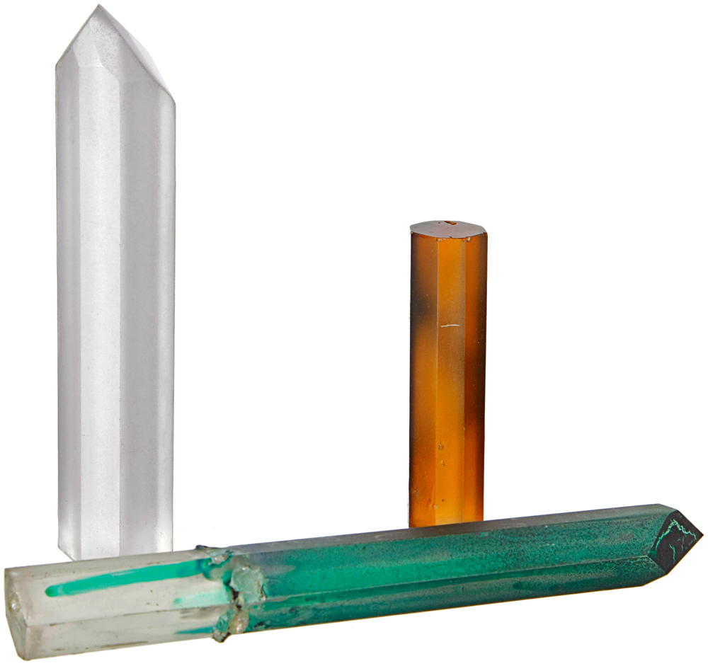
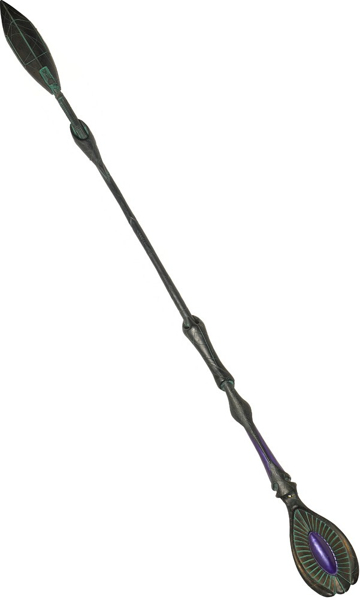

# STARGATE SG-1: TECHNICAL MANUAL

**STARGATE COMMAND ENGINEERING & OPERATIONS REFERENCE, FIRST EDITION**

*Companion volume to the Atlantis Expedition Reference. Prepared in the tradition of the Star Trek Writers'/DS9 Technical Manuals: an in-universe reference consolidating broadcast canon, with clearly marked engineering extrapolation.*

---

## ABOUT THIS DOCUMENT

This manual provides the detailed technical background that stories set at Stargate Command and across the Milky Way sometimes need. It is a supplement to, not a replacement for, character and drama, the rule holds that when Colonel Carter rewires a naquadah reactor, the audience needs to see it work, not hear a lecture.

**Edition pin.** This First Edition reflects the command's status quo as of **mid-2008 CE, following the end of the Ori threat and the final Ba'al timeline incident** (see §1.5). Events after that point are not reflected here.

**Conventions used throughout:**

| Marker | Meaning |
|---|---|
| *(no marker)* | Established by on-screen canon as broadcast (the two direct-to-film missions count as broadcast) |
| **[E]** | Extrapolation — internally consistent engineering detail where the screen was silent. May be refined, never casually contradicted |
| **[W]** | Writer's latitude note — guidance on how hard this rule binds you |

Where this manual conflicts with a filmed episode, the episode wins. Log the conflict in Appendix C.

**Companion volume:** Pegasus-side technology, Atlantis city systems, Wraith/Asuran dossiers, and full Tau'ri vessel specifications (BC-304, F-302) are covered in the *Atlantis Expedition Reference* and are summarized by cross-reference only.

**Structure:** Part One sets the strategic theater. Part Two is Stargate Command itself. Parts Three–Five cover gate operations, vessels, and weapons. Part Six is the threat dossier. Part Seven defines command structure and team doctrine. Part Eight catalogs hazards and phenomena. Appendices carry glossary, conversions, the canon log, and index.

---

## PART ONE: THE MILKY WAY THEATER

### 1.0 Introduction

Stargate Command is a buried vault under a mountain in Colorado, through which the United States, in secret partnership with the world's major powers, has spent a decade fighting gods, robots, ascended tyrants, and its own government's shadow agencies. Every system in this manual should be read through that lens: Earth is the newest kid in a very old neighborhood, armed with borrowed weapons, stubbornness, and the best pure scientists of two galaxies.

**In brief:** Unlike the Atlantis Expedition, SGC builds as well as inherits. A decade of reverse engineering produced human starships, energy shielding, and fighters; the price was constant exposure to enemies who have been gate-traveling for five thousand years longer.

### 1.1 The Strategic Situation

| Property | Value |
|---|---|
| Theater | Milky Way Galaxy |
| Command post | Cheyenne Mountain Complex, Colorado Springs, USA |
| Gate network density | High but patchy — Goa'uld depredations removed gates from some worlds; network predates them by ~50,000,000 years |
| Program posture | Transitioning from covert defense to open interstellar power; secrecy still formally intact |

Three facts define every strategic decision:

1. **The old order collapsed faster than anyone expected.** The System Lords went from galactic masters to scattered remnant inside ten years, not because Earth outbuilt them, but because SG-1 kept decapitating whoever stood tallest.
2. **Power vacuums fill.** The Lucian Alliance inherited the smuggling lanes, the kassa fields, and much of the former slave economy. The Free Jaffa Nation inherited Dakara and an army. Neither inherited restraint.
3. **Earth's real shield is obscurity.** One confirmed alien incursion ends the secrecy that keeps six billion people from being a target. Every protocol in this manual ultimately serves that fact.

**[W]** SG-1 stories run on asymmetry: humans win by knowledge, sabotage, and alliance, never by fleet engagement until the Asgard gift arrives, and even then, one ship at a time.

### 1.2 Consolidated Timeline

| Era | Event |
|---|---|
| ~50,000,000 years ago | Ancients seed the Milky Way gate network during their era of dominance |
| ~10,000 years ago | Ancient–Goa'uld war ends with Anubis broken and the Ancients mostly gone (plague, Ascension). Ra consolidates Goa'uld dominion using recovered chariot fleets |
| 1928 | The Giza stargate is excavated |
| 1994 | Project Giza succeeds: a team passes through to Abydos and destroys Ra. The gate is mothballed |
| 1996 | Apophis raids through the gate; the program reactivates permanently as STARGATE COMMAND under Cheyenne Mountain. SG-1 stands up shortly after |
| 1997–2000s | System Lord wars: Apophis, Heru'ur, Sokar, Cronus fall in succession. Tok'ra alliance formed. Tollana destroyed by Anubis. Replicators arrive from Ida-galaxy war and are defeated with Asgard aid |
| mid-2000s | Anubis returns half-Ascended; defeated at Dakara. Free Jaffa Nation founded. Ori crusade begins through the supergate. The Trust infiltrated by Goa'uld remnants. Lucian Alliance rises |
| 2007 | Ori fleet destroyed via the Sangraal scheme and the Ark of Truth mission; Adria ascended and checked. The Asgard, dying, end their species and bequeath their entire technological legacy to the Tau'ri aboard the Odyssey |
| 2008 | Ba'al's clone-network timeline manipulation defeated (the Continuum incident). Last System Lord gone. See §1.5 for the resulting posture |

### 1.3 Technological Assessment of Major Powers

*(Full dossiers in Part Six.)*

**The Goa'uld Remnant.** Parasitic overlords posing as gods, commanding Jaffa armies, ha'tak fleets, and stolen Ancient tricks. Militarily broken as an empire; individually lethal, treacherous, and functionally immortal via sarcophagus. Their true weapon was always worship management, and they still practice it wherever kassa flows.

**The Free Jaffa Nation.** Former warrior-caste of the gods, now a fractious theocratic-republican state centered on Dakara. Massive ground armies, captured ha'tak fleets, deep warrior culture. Ally by default; ally by choice only while external threats hold the factions together.

**The Tok'ra.** The Goa'uld resistance, same species, opposite ethics, shared biology. Queen Egeria's children fight a guerrilla intelligence war against their own kind. Blending (host + symbiote) remains the galaxy's best infiltration technology. Their population is in terminal decline.

**The Asgard (Legacy).** The galaxy's senior technological power ended itself rather than die of genetic decay, gifting everything, hyperdrives, beam weapons, shields, their consciousness archive, to Earth. Nothing Asgard-built can currently be replaced; everything Asgard-designed must be learned.

**The Ori (ended).** Ascended beings who fed on human worship, exporting forced religion through Priors and ships built by enslaved galaxies. Their military machine is broken and their leader checked by a peer Ascended being; their scripture survives, and so does the market for false prophets.

**The Replicators (ended).** Self-assembling machines that consumed technology and fleets across two galaxies, culminating in human-form variants indistinguishable from people. Destroyed at Dakara (Milky Way) and Asuras (Pegasus). Nanite cousins of the Asuran type remain a standing hazard.

**The Lucian Alliance.** Post-imperial organized crime: former slaves and soldiers running smuggling, kassa narcotics, and captured warships under a council of "bosses." Underestimated at everyone's peril.

### 1.4 The Gate Program's Founding Technologies

**In brief:** Everything SGC operates descends from three acquisitions: the Giza gate (1928), Ra's chariot technology salvaged from Abydos (1994), and a decade of battlefield salvage plus Asgard friendship.

Reverse-engineering lineage, in order of maturity:

1. Naquadah chemistry and explosives (from staff weapons and chariots)
2. Iris defense and gate dialing computers (indigenous engineering around Ancient hardware)
3. Energy shielding (Goa'uld design, human-built)
4. Hyperdrive (Goa'uld principles → Asgard refits)
5. Naquadria weapons physics (Jonas Quinn's homeworld research; unstable, potent)
6. Beaming, sensors, plasma beams, and computer cores (the Asgard gift, 2007)

**[W]** Each lineage item should fail realistically before it works reliably. The show's credibility lives in the gap between "alien artifact" and "fielded system."

### 1.5 Status Quo Snapshot (Edition Pin: Mid-2008 CE)

The state of play every new story inherits:

| Domain | Status |
|---|---|
| Command posture | SGC operational under Homeworld Security; IOA oversight; secrecy formally intact, program's existence an open rumor |
| Flagship | Odyssey (BC-304) carrying the complete Asgard legacy core — the single most valuable object in two galaxies |
| Fleet | Three 304s active (Odyssey, Daedalus, Apollo) + George Hammond commissioning **[E]**; Prometheus lost 2006 |
| Goa'uld | Empire broken; remnant warlords, the Trust's hijacked cells, and free parasites remain dangerous at knife-fight range |
| Jaffa | Free Jaffa Nation holds Dakara; civil tensions between warrior factions and reformists simmering |
| Tok'ra | Reduced to a few hundred operatives; intelligence value still outsized |
| Ori | Crusade ended — fleet destroyed, leader checked post-Ascension; Priors' scripture circulating as a cult hazard |
| Replicators | Destroyed in both galaxies; human-form wreckage and nanite caches under quarantine doctrine |
| Lucian Alliance | Ascendant criminal power; council politics, kassa trade, growing fleet of captured warships |
| Atlantis link | Pegasus expedition operating independently; gate bridge severed after Midway Station's destruction, ship convoy legs continuing |

**[W]** This is a *post-victory* snapshot, rarer than a wartime one and harder to write. The drama lives in what victory left behind: weapons that outlived their wars, allies who need enemies, and a secret too big to keep forever.

---

## PART TWO: STARGATE COMMAND

### 2.0 Complex Overview

**In brief:** Stargate Command occupies the deep sub-levels of Cheyenne Mountain Complex, Colorado Springs, a hardened Cold War facility chosen because it was already blast-proof, already secret, and already bored. NORAD and North American aerospace defense continue operating on the upper levels; neither knows what the lower levels do beyond "black budget."

| Property | Value |
|---|---|
| Location | Inside Cheyenne Mountain, Colorado — ~2,000 ft of granite overhead **[E]** |
| Depth of SGC ops | Sub-levels ~19 through 28 **[E]** |
| Gate room | Level 28 |
| Complement | Several hundred military and civilian personnel across shifts **[E]** |
| Hardening | Rated against nuclear near-miss; spring-loaded on massive shock absorbers; internal blast doors at every level |

The mountain is the program's second iris. Anything that comes through the gate still has to fight through twenty-eight levels of blast doors, bunkrooms, and Marines to reach daylight.

```
   CHEYENNE MOUNTAIN — SECTION CUT (schematic, not to scale)

        /\  granite overburden ~2,000 ft **[E]**
       /  \    NORAD / aerospace defense (upper levels)
      /    \   -------------------------------
     |      |  ... blast doors each level ...
     |------|  L19-27: admin · barracks · labs · armory
     |======|  L28 +------------------+
     | GATE |       |   CONTROL ROOM   |  observation gallery
     | ROOM |       |  (overlook)      |
     | [GATE]|      +------------------+
     |======|       gate frame flanked by ramp, MALP bay,
     |------|       iris control, weapons lockers
     | SUBS |  sub-levels: naquadah storage, self-destruct
     |------|  chambers, brig, isolation wards
     |______|

   * spring-mounted facility on shock absorbers
   * two nuclear self-destruct devices at the base **[E]**
   * power: external grid + backup generators; naquadah cells post-2000 **[E]**
```

### 2.1 Structures and Layout

**Gate room.** The heart of the complex: the stargate stands on a raised ramp facing a rolling blast-door wall. Every activation begins with an "unauthorized off-world activation" klaxon and ends with either the iris or a kawoosh into the reinforced back wall. The room doubles as arrival/departure hall, ceremony space, and, more often than command would like, the first line of defense.

**Control room.** Elevated gallery overlooking the gate room: dialing computer stations, iris control, life-signs detection, MALP telemetry, and the general's briefing alcove. One staircase connects it to the floor below; the layout is canon.

**Support levels.**

| Level | Function **[E]** |
|---|---|
| Armory & firing ranges | P-90s, staff weapon racks, zats under lock |
| Science labs | Carter's domain; reverse-engineering benches, naquadah test cells |
| Infirmary/Isolation | Janet Frasier's legacy wing; quarantine pods for gate-borne pathogens |
| Brig & holding | Hostile visitors, Goa'uld hosts awaiting extraction |
| Naquadah/enhanced ordnance storage | Hardened, dual-officer access |
| Briefing theater | The table where every mission lives or dies |

### 2.2 Command Systems

**In brief:** The dialing computer is the oldest human-built gate interface in existence, seven chevron locks rendered on CRT-descendant consoles, and it still works because its operators know it cold.

- Dialing sequence: symbol selection → chevron lock display → energy buildup → kawoosh. Outbound dialing draws from city-grade capacitors charged by the base grid **[E]**.
- Iris control is one officer's station with a manual override; the code word protocol (§3.2) gates every reopening.
- Life-signs detection overlays the gate room during arrivals, human, Jaffa, Goa'uld symbiote, and "unknown" all read differently.
- Off-world telemetry (MALP video/audio/science feeds) routes to the control room and the briefing room simultaneously.

### 2.3 Computer Systems

Earth-standard network hardened against intrusion, bridged to Ancient interfaces where required (the repository chairs, Dakara's weapon console). Key facts:

- The base network has survived Goa'uld, Replicator, and Trust intrusions; every breach drove partitioning. Off-world data returns through sanitized relay terminals only.
- The Asgard core aboard *Odyssey* is a separate class of object entirely, a compressed archive of a civilization. Access protocols are still being written.
- Cryptography is Earth-standard plus salvaged Goa'uld encryption for captured hardware.

### 2.4 Power Generation

- **Base load:** external civilian grid through redundant feeds, backed by diesel generators **[E]**; naquadah cell banks installed from the early 2000s onward now carry critical systems.
- **Gate dialing:** capacitor banks recharge between activations; rapid successive dials are possible but logged **[E]**.
- **Weapons-grade naquadah/naquadria:** stored in hardened magazines; Mark VII-class warheads and enhanced munitions require presidential authorization to employ.

### 2.5 Defensive Systems

**The Iris.** The command's signature defense: a titanium (later trinium-alloy **[E]**) shutter mounted microns off the receiving event horizon, closing in a fraction of a second. Matter reintegration against the iris is fatal to the traveler, nothing arrives without permission. The iris opens only on a valid IDC (§3.2). Its weakness: radio passes both ways, so the enemy can *listen* even when they cannot enter.

**Blast doors and compartmentalization.** Every level seals; the gate room's back wall absorbs the kawoosh routinely. Intrusion drills are weekly.

**Self-destruct.** Two nuclear devices at the mountain's base, armed by joint authorization (command officer + president's line), on a countdown that has been stopped with seconds remaining more times than anyone says aloud. Doctrine: no invader keeps the mountain, the gate, or the secret.

### 2.6 Emergency Operations

| Condition | Trigger | Response |
|---|---|---|
| Unauthorized activation | Inbound wormhole without IDC | Iris closed, Marines to the ramp, control room lockdown |
| Base lockdown | Intrusion, contamination | Blast doors per level, off-world teams recalled |
| Quarantine | Gate-borne pathogen | Full seal; medical has override authority over the military chain — deliberate design (§7.0) |
| Evacuation | Unrecoverable compromise | Personnel through the gate to the Alpha Site; self-destruct covers withdrawal |

### 2.13 Satellite Installations

| Installation | Function | Notes |
|---|---|---|
| **Alpha Sites (I–III)** | Standing evacuation worlds for gate-borne withdrawal | Each successor site was established after the last was compromised; the current iteration's location is the most tightly held secret in the program |
| **Area 51 (Nevada)** | Deep storage, reverse-engineering, X-series prototyping | SGC's rival sibling: where captured tech goes to be studied apart from operations; repeatedly infiltrated, occasionally blown up |
| **Antarctic Outpost** | Ancient weapons platform under the ice | Spent saving Earth from Anubis' fleet; geologically entombed, ATA-keyed (§8.11) |
| **Homeworld Command / the Pentagon** | Political and liaison nerve center | Where stone-swapped officers attend meetings in borrowed bodies |
| **Icarus-class sites** | Naquadria-core nine-chevron research | Pegasus-side discovery; see companion SGU manual §1.6 |

### 2.14 Life Aboard

**In brief:** The mountain is not a workplace; for off-world teams it is a home garrison. Stories live in its rhythms as much as its crises.

- **The briefing table** is the program's true command center: mission orders, threat assessments, arguments that decide who lives, and the memorial plaque on the wall behind it listing every officer lost through the gate. It is read aloud on anniversaries.
- **Quarters, commissary, gym:** off-world teams bunk in the mountain on rotation; the mess hall is where ranks blur and intelligence gets traded.
- **The vaults below** store everything the program cannot explain yet. The inventory of unexplained artifacts is itself classified.
- **Morale infrastructure:** movie nights on the gate-room projector between alerts, team traditions, and the standing joke about requesting transfer to a planet with a beach.

**[W]** Bureaucracy is a set: requisition forms, psych evals, congressional auditors. Use paperwork beats to pace between firefights, the contrast is the show's signature rhythm.

---

## PART THREE: STARGATE NETWORK OPERATIONS

### 3.1 Wormhole Mechanics (Milky Way Network)

**In brief:** The physics match the Pegasus network (see companion manual §3.0), matter-to-energy transit, 38-minute connection ceiling, one-way travel, radio-only reverse communication. Milky Way specifics:

- Gates are ~6.7 m diameter naquadah rings, 29+ metric tons; most stand on DHD pedestals installed by the Ancients' build-out.
- The dialing ring rotates physically to select glyphs (Pegasus gates have fixed illuminated rings), slower, louder, and beloved of no one in a hurry.
- A receiving gate can be made to "jump" and displace travelers if enough local power surges through it, an occasional hazard, occasionally a tactic.
- Gates removed from their pedestals can be laid horizontal, flown through space gates, or dragged between worlds by ships; the network is furniture as much as infrastructure.

### 3.2 Gate Operations Policy

1. **Inbound screening.** Klaxon → iris → life-signs scan → wait. Nothing opens until a recognized IDC transmits.
2. **IDC protocol.** Off-world teams carry GDO transmitters; codes rotate on compromise, and captured GDOs rotate them immediately.
3. **Outbound policy.** Mission briefings precede every dial; MALP probe goes first to any world not surveyed within standing memory; first-contact teams follow the survey package (companion manual §3.2 applies).
4. **Quarantine.** Medical screening on return is universal; the Frasier wing's authority over gate traffic is absolute during biological events.
5. **Blacklist doctrine.** Worlds hosting Ascended beings, active Replicator nanites, Aschen contact, or uncontrolled time phenomena are computer-locked at the dialing level.

**[W]** Every gate scene is a checkpoint scene, klaxon, iris, code, ramp. Break procedure only when the story pays for it.

### 3.3 Known Network Peculiarities (Milky Way)

- **The kawoosh.** The unstable vortex on connection disintegrates anything in the dialing gate's plane, weaponizable with timing and a ramp.
- **Gate bridges/supergates.** Ori forces constructed an 80-segment supergate near the galactic rim by converting a planet's native gate and feeding it captured ships as raw material; a second supergate linked to Pegasus during the Wraith conflict. Supergates pass capital ships; they are strategic chokepoints, permanently contested.
- **DHD attrition.** Decades of Goa'uld removal and neglect left many worlds DHD-less; SGC's dialing computer can compensate for missing pedestals at reduced safety margin.
- **The correlative update system.** The network self-syncs stellar drift corrections across the galaxy, proof of Ancients-scale engineering, discovered when the system reached out and touched the SGC dialer.

### 3.5 Chevron Configurations

**In brief:** Address length encodes distance class, and each extra chevron multiplies the power bill.

| Configuration | Reach | Power requirement |
|---|---|---|
| 7 chevrons | Intra-galactic (Milky Way) | DHD pedestal or SGC capacitors |
| 8 chevrons | Intergalactic — the Othala (Asgard home) and Pegasus-class addresses | Planetary-scale energy; Icarus-class naquadria veins or ZPM |
| 9 chevrons | Unique fixed deep-space targets — ships in flight | Icarus-class planetary core resonance only **[W]** |

**[W]** The nine-chevron dial is how stories find *Destiny* from anywhere, and its power bill is why nobody casual does it. Every nine-chevron plot must first solve a planet-sized energy problem on-screen.

**Gate incident doctrine (supplementary):**

- The kawoosh disintegration zone extends several meters past the gate plane; the ramp's length is a safety calculation, not decoration.
- A traveler interrupted mid-transit suspends in the matter buffer, no recovery without exotic hardware; treat as death with paperwork.
- Gates struck by sufficient energy during an open connection can be forced to "jump" their aperture to another ring entirely, demonstrated once by accident and once as a tactic **[W]**.


*Field reference: the dialing computer's operator console, chevron locks, iris control, and MALP telemetry share this single desk.*

---

## PART FOUR: VESSELS

**Recognition reference:** major hulls to scale, see plate `Stargate SG-1 - Ship Recognition Plate.png` (companion file, this folder).

### 4.1 Tau'ri Vessels

#### BC-303 Prometheus (lost)

Earth's first true battlecruiser: human hull around reverse-engineered Goa'uld systems, later refitted with salvaged Asgard upgrades (shields, hyperdrive, sensors). Destroyed 2006 off Tangea **[E]** during an operation against the Trust. Retained here because every 304 doctrine descends from her.

| Specification | Value |
|---|---|
| Length | ~200 m **[E]** |
| Complement | ~80–115 |
| Weapons | Railgun batteries, VLS missiles (naquadah-enhanced warheads) |
| Defense | Asgard shields (retrofitted) |

#### BC-304 Daedalus-Class Deep-Space Battlecruiser

**In brief:** Earth's only true intergalactic warship class; the program's lifeline, cavalry, and occasionally its last hope. Asgard-supplied hyperdrive, shields, sensors, and beaming married to a human-built naquadah/trinium hull. *(Specifications are mirrored in full in the companion Atlantis Reference §4.1, the class serves both theaters.)*

| Specification | Value |
|---|---|
| Length × width × height | 225 m × 95 m × 75 m |
| Complement | ~200 crew + air group; 8–16 F-302 interceptors |
| Drive | Asgard hyperdrive — Earth↔Pegasus in ~18 days unassisted; a ZPM dedicated to the drive shortens this to days **[W]**. Sublight: ion/fusion hybrid |
| Primary weapons | 32 railguns (massed kinetic turrets); 16 VLS missile tubes — cruise missiles, Mark VIII and Mark IX naquadah-enhanced nuclear warheads |
| Upgraded fit (Block II) | 4 Asgard plasma beam weapons (nose-mounted); ship-killing lances — two hits typically gut a hive **[W]** |
| Defense | Asgard shields; naquadah/trinium composite hull |
| Transporters | Asgard beaming (planetary range; blocked by jamming) + ring transporters for heavy cargo **[E]** |
| Sensors | Asgard sensor array (deep-space grade) |

**Deep-dive, systems by station:**

| Zone | Systems | Notes |
|---|---|---|
| Forward | Bridge/CIC, beaming array trunk, forward railgun mounts | Command crew of 6–8 **[E]** |
| Midships | Hangar bay (ventral), 302 maintenance, marine quarters | Launch via ventral doors; recovery by arrestor net |
| Engineering | Naquadah reactor room, Asgard systems core (beaming + hyperdrive control), Mark VIII/IX VLS magazines | The Asgard core is the ship's soul — irreplaceable; Earth cannot build it |
| Aft | Main engines, fusion plant, cargo holds | Convoy stores for interstellar legs |

- **Refit blocks:** Block I (railguns/nukes only) → Block II (Asgard beam weapons fitted after the Asgard's final gift). Know which block your story's hull is; it changes every tactical scene.
- **Beaming doctrine:** Asgard transporters give the 304 her real superpower, inserting teams onto moving ships or extracting them from anything without jamming. Wraith, Asuran, and some Goa'uld-era jamming neutralizes this entirely.
- **Milky Way assignments as of pin date:** Odyssey (flagship; carries the Asgard legacy core), Daedalus (Atlantis rotation), Apollo (Pegasus theater), George Hammond (commissioning trials **[E]**)

#### F-302 Interceptor

**In brief:** Earth's first spaceframe built around recovered alien technology, a two-seat atmospheric/space superiority fighter carried aboard 304s. Not a match for a Wraith dart or death glider wing one-on-one; decisive when flown with discipline, numbers, or a plan involving the word "hyperspace." *(Specifications mirrored in companion Atlantis Reference §4.1.)*

| Specification | Value |
|---|---|
| Crew | 2 (pilot / EWO — electronic warfare & weapons officer) |
| Length | ~14 m **[E]** |
| Propulsion | Twin aerospace turbines (atmospheric) + fusion-boost ramjets (space); naquadah-augmented afterburner for combat dash **[E]** |
| Hyperdrive | Single-jump capability: one short in-system jump per flight, then coil refit **[W]** — the tactical signature of the type |
| Weapons | 2 nose railguns; internal bays for air-to-air missiles (naquadah-enhanced warheads on later blocks) |
| Defense | Trinium-composite airframe; no energy shields |
| Endurance | Hours, not days; carrier-based doctrine |

**Systems notes:**

- The single-jump rule is structural: jump coils burn out with each use. A pilot who jumps is committing to a one-way engagement geometry, arrive behind the enemy or don't bother.
- EWO station handles sensors, missile guidance, and the jump solution; the aircraft fights as a crewed system, which is why two-person crews are non-negotiable.
- Against gliders and darts alike: the enemy out-accelerates the 302 but dies to a single clean railgun burst. Doctrine is leader-wingman bracketing off launch shadows, never furballs.
- Recovery: net-arrestor landing onto the 304's ventral bay; no catapults **[E]**.

**X-series lineage:** the F-302 descends from the **X-301 Interceptor**, a reverse-engineered death glider hybrid that flew exactly once before its salvaged Goa'uld systems (and a hidden recall device) nearly killed its test pilots. The lesson birthed the X-302 prototype: *build Earth airframes around alien power, not alien airframes around human controls*. Every 302 doctrine, crewed systems, single-jump discipline, arrestor recovery, was paid for in that program.

### 4.2 Goa'uld Vessels

#### Ha'tak-Class Mothership

**In brief:** The pyramid-topped workhorse of two empires, Goa'uld flagship, troop carrier, and orbital siege platform for five millennia. A captured ha'tak taught Earth more about space warfare than any other single acquisition.

| Specification | Value |
|---|---|
| Length | ~700 m across the base **[E]** |
| Complement | ~2,000 Jaffa + pilots **[E]**; dozens of death gliders; al'kesh and tel'tak in bays |
| Drive | Naquadah hyperdrive — interstellar, not intergalactic; slow by Tau'ri/Asgard standards |
| Weapons | Staff cannon batteries (heavy plasma analogues); bombardment-grade |
| Defense | Energy shields; naquadah-reinforced hull |
| Command | Pel'tak bridge with throne; control crystals throughout |

Doctrine: ha'taks win through massed fleet presence and ground armies. One-on-one against a post-refit 304 they lose; against a planet they are still the end of the world.

#### Al'kesh-Class Bomber

Mid-sized gunship/bomber (~100 m **[E]**): shielded, staff-cannon armed, bomb-capable. The Goa'uld answer to "what if a glider had to survive more than one pass." Excellent raider; standard Lucian Alliance acquisition.

#### Tel'tak-Class Cargo Ship

The galaxy's pickup truck (~15 m **[E]**): cargo hold, ring transporters, short-range rings for boarding, modest shields. Stealthy by being beneath notice. SGC has operated captured tel'taks continuously since year one, the most-flown hull in the program's history.

#### Death Glider

Two-seat atmospheric/space fighter (~5 m **[E]**): twin staff cannons, no hyperdrive, no shields on most marks. Carried by ha'taks and planetary garrisons. Fast, agile, fragile; the sound of them is the sound of a bad day.

#### Glider-adjacent: Needle Threader

A modified glider with wing-fold for gate transit, Anubis-era special operations craft. Rare, dangerous to fly, canon-unique enough that encountering one is a story **[W]**.

### 4.3 Asgard Vessels

**Beliskner-class / O'Neill-class cruisers.** The senior power's fleet: small hulls (~1,500 m for O'Neill-class **[E]**) with overwhelming shields, ion cannons, and intergalactic hyperdrives. The O'Neill class was named for the human who earned it. All were scuttled at the Asgard end, their doctrine was denial of capture, and their final act gifted the design philosophy instead of the ships.

**Science vessels** (e.g., *Daniel Jackson*-class), cloaked research platforms with matter-phase capabilities. Also gone; remembered here because half of Asgard salvage doctrine comes from their wrecks.

### 4.4 Ori Vessels (defeated force)

Satellite-shaped motherships grown from worship-directed technology: white armor, energy weapons that out-ranged everything afloat, shield-piercing saturation fire. Built by converted galaxies in months. The class died with its supply line of faith, remaining hulks are quarantined salvage under IOA seal.

---

## PART FIVE: WEAPONS AND FIELD EQUIPMENT

### 5.1 Ship and Base Weapons

| System | Type | Notes |
|---|---|---|
| Railguns | Electromagnetic kinetic turret | Indigenous Earth design; the 304s' workhorse before beam weapons |
| Mark III–IX nuclear warheads | Naquadah-enhanced fission/fusion | Yield scaling by mark; Mark IX ("Gate buster") is a city-killer with naquadria boost **[E]** |
| Horizon-type orbital platforms | Multi-warhead delivery | Pegasus theater (companion §5.1); Milky Way equivalents under development **[E]** |
| Asgard plasma beams | Ship-killing lance | Post-gift fit on 304s; two-shot capital kills observed |
| Staff cannon (captured) | Heavy plasma emplacement | Used for base defense trials; ammunition is a naquadah cell |
| Self-destruct ordnance | Two strategic nuclear devices | Base denial; see §2.5 |

### 5.2 Personal Weapons

**In brief:** SGC doctrine pairs Earth infantry arms with captured Goa'uld sidearms, each covers the other's weaknesses.

- **FN P-90:** standard off-world weapon; high-capacity, armor-piercing, compact enough for gate combat.
- **Service pistol (9mm/M9):** secondary.
- **Zat'nik'tel (zat):** Goa'uld sidearm, limited issue. One shot disables, two kills, three disintegrates, the third setting makes it both a tool and a war crime waiting for a bad day.
- **Staff weapon:** powerful, inaccurate untrained, loud as prophecy; issued to specialists who train with it (Teal'c standard).


*Field reference: staff weapon in armory storage, naquadah cell visible at the receiver.*
- **Tranquilizer/TER combinations:** TER (Transphase Eradication weapon) doubles against phased Re'tu, see Part Six.

**[W]** The zats-versus-rifles debate is canon texture: rifles kill what zats stun, zats capture what rifles would have to kill. Choose per scene, not per policy.

### 5.3 Protective and Field Equipment

- **Vest/plate carriers:** Earth-issue; rated against staff bolts marginally, most of a vest's value is stopping shrapnel from the wall behind you **[E]**.
- **GDO/IDC transmitter:** the way home; guarded like one.
- **Life-signs detector (handheld):** Goa'uld-derived scanner reading human/Jaffa/symbiote signatures at short range.
- **Naquadah grenades:** enhanced demolitions; the galaxy's favorite door key.
- **Field science kit:** sample containment, radiation survey meter, portable MALP relay.

### 5.4 Recovered Alien Technology Register

**In brief:** Captured devices SGC has learned to operate (not build). Each entry lists what it does and why command limits it.

| Device | Function | Control status |
|---|---|---|
| Ribbon device (kara kesh) | Telekinetic force blasts; energy shield projection (System Lord grade) | Seized examples in armory; operation appears naquadah-in-blood dependent — humans cannot activate **[W]** |
| Healing device | Accelerates tissue repair via operator intent | Goa'uld-operated only; Tok'ra variants serve the SGC infirmary under supervision |
| Sarcophagus | Full resurrection/healing | *Not* in service. Ruled: repeated use causes megalomaniacal degradation (§6.0); medical division holds a standing prohibition with exactly one morally catastrophic exception on record **[W]** |
| Ring transporters | Short-range matter teleport between ring platforms | Aboard 304s and captured tel'taks; standard boarding tool |
| Cloaking generator (cargo ship) | Energy signature concealment | Fitted to select tel'taks; Earth cannot reproduce the crystal stack |
| TER (transphase eradication) | Reveals/strikes phased Re'tu | Special authority issue (§8.4) |
| Kull disruptor | Severing engineered blended life-force (anti-Kull) | Irreplaceable Ancient-derived salvage (§6.3) |
| Ancient drone platform chair (Antarctica) | Controls the Outpost's drone weapon arsenal | One-time planetary defense asset; spent ZPM removed — see §8.7 |

### 5.5 MALP Fleet

**In brief:** The Mobile Analytic Laboratory Probe is the program's expendable vanguard: wheeled camera/telemetry platforms sent through the gate first to answer three questions, air, inhabitants, immediate threat.

- Standard fit: stereoscopic cameras, microphone, atmospheric sensors, laser rangefinder **[E]**.
- Losses are expected and budgeted; the fleet's real product is the survey archive every mission brief draws from.
- Variants: tethered climber units for cliff-side gates, and at least one armed prototype that did not survive field trials **[E]**.

### 5.6 Strategic Materials

**In brief:** Four substances underwrite every power source, hull, and warhead in two galaxies. Control of any one of them is strategic policy at the IOA level.

| Material | Properties | Program usage |
|---|---|---|
| **Naquadah** | Energetic superheavy mineral; amplifies energy release; the substrate of gate rings, staff weapons, and ha'tak hulls | Warheads, reactor fuel, storage magazines under dual-officer control |
| **Naquadria** | Unstable naquadah isotope (Langaran discovery); orders of magnitude more energetic — and prone to runaway cascade | Mark IX-class warheads; Icarus-class dialing cores; handling requires planetary-evacuation contingencies |
| **Trinium** | Ultra-light structural metal far exceeding terrestrial alloys | Hull plating (naquadah/trinium composite on 304s), iris refinement, airframe members |
| **Neutronium** | Degenerate matter used by Asgard engineering | Core component of Asgard technology; Earth possesses stockpiles it cannot yet fully work |

**[W]** Materials scarcity is this volume's version of Atlantis' ZPM economy. Naquadria in particular is a loaded gun: every story that touches it should end with less of it than before.

---

## PART SIX: THREAT DOSSIERS

### 6.0 The Goa'uld

#### Biology

**In brief:** Aquatic serpent parasites that wrap a host's spinal column, interface directly with the brain and motor system, and suppress the host's consciousness entirely. They speak through a voice-flanging organ, heal their hosts continuously (a host lives centuries), and carry genetic memory, every Goa'uld is born remembering the empire's entire tyrant catalogue.

**More:**

- **Blending:** a Goa'uld may coexist with a host voluntarily (the Tok'ra model) rather than enslave it, same biology, opposite philosophy, endless mutual distrust between the branches.
- **The sarcophagus:** resurrects the dead and heals anything, at the cost of progressive megalomania and soul-deep dependency. Long-term users (System Lords) are functionally immortal and functionally insane; that correlation is not a coincidence and is arguably the empire's root cause of failure.
- **Naquadah in the blood:** Goa'uld physiology incorporates naquadah, detectable by life-signs scanners, exploitable in weapons interactions, and the reason a Goa'uld can operate ribbon devices and healing devices that do nothing for humans or Jaffa.
- **Queens and reproduction:** only queens spawn larvae; controlling a queen means controlling the species' future. Egeria (Tok'ra founder) and the Kull-program queen were strategic assets of exactly this order.

#### Society and Strategy

The empire was never an empire, it was a protection racket wearing theology. System Lords held worlds through Jaffa intermediaries, staged ritual wars among themselves, and collapsed the moment humans learned gods could be shot. Remnant strategy since: infiltration (the Trust), mercenary fleets (Lucian Alliance adjacency), and quiet rebuilding around forgotten stargates.

**The machinery of worship** (how five thousand years of godhood actually worked):

- **Staged miracles:** ring-transporter appearances, staff-weapon demonstrations against "demons," plague cures from the healing device. The technology gap did the theology; the priests just kept the schedule.
- **Intermediate divinity:** most worlds never met their god, only Jaffa priests relaying orders. This made the empire administrable and brittle: when Jaffa stopped believing, the gods had no hands.
- **Punishment rites:** examples were made publicly and supernaturally, invisibility cloaks, long-range strikes on temples. Fear management was logistics.
- **Host politics:** a god's face was a hostage's face. Hostage rescue is therefore not compassion policy but decapitation doctrine, and every host recovered was an intelligence windfall.

**Engagement rules:** Never assume a defeated Goa'uld is dead, sarcophagus, clones, or a larva in someone's abdomen will settle that. Never let one near a sarcophagus, a queen, or a camera. Always ask which god the locals still secretly believe in.

### 6.1 The Jaffa

**In brief:** A genetically engineered human offshoot bred as incubators and soldiers: every adult carries a larval Goa'uld (prim'ta) in an abdominal pouch until it matures for implantation in a host or new Jaffa. The prim'ta doubles as their immune system, a Jaffa without a symbiote sickens and dies within days without tretonin.

**More:**

- **The prim'ta economy:** infant Goa'uld are carried to maturity by Jaffa, which is why the empire needed the Jaffa, and why freeing them broke the empire.
- **Tretonin:** Tok'ra-derived synthetic that replaces symbiote immunity entirely; the single most liberating substance in the galaxy, and the Free Jaffa Nation's true founding document.
- **Warrior culture:** strength-honor doctrine, martial arts lineage, staff training from childhood. A Jaffa warrior is a match for any soldier alive; a *free* Jaffa warrior is an ally worth two.

### 6.2 The Tok'ra

The resistance branch of the Goa'uld species, founded by the queen Egeria's idealist offspring: voluntary blending, shared consciousness, shared lifespans, zero worship. Operational profile: intelligence gathering, sabotage, infiltration of System Lord courts via hosts who consent and often grieve when the symbiote dies.

**Status:** Terminal decline, no living queen, losses across a decade of war, and hosts harder to recruit now that the fight is won by others. Their archives outvalue their operatives at this point **[W]**.

### 6.3 Kull Warriors

**In brief:** Anubis's ultimate infantry: hollow human hosts implanted with engineered Goa'uld born of a queen fused with Ancient healing technology, blank soldiers with absolute loyalty, no fear response, and armor that shrugs off staff fire and zats alike.

- Kill method: the **Kull disruptor**, an Ancient-designed energy weapon tuned to sever the Kull's blended life-force. Only a handful exist; each is irreplaceable salvage.
- Post-war status: surviving Kull are uncommanded weapons, mindless, immortal-ish, and still following last orders. Standing bounty on sightings.

### 6.4 The Replicators (ended force)

Self-assembling blocks consuming advanced technology galaxy-wide; destroyed at Dakara when the superweapon disassembled their binding structure galaxy-wide.

- **Block-form (Ida/Milky Way type):** lego-simple units networking into ships and swarms; they ate technology, ignored organics, and beat the Asgard to a standstill until Earth's stubbornness introduced them to human unpredictability.
- **Human-form variants:** nanite constructions indistinguishable from people, Fifth, the RepliCarter, and the tragic line of androids who wanted love or ascension and settled for war. Human-forms added strategy, empathy-simulation, and genuine moral horror to what had been an insect problem.
- **Origin note:** created as a cleaning tool by a doomed android creator; every galactic catastrophe since traces back to one lonely inventor's mistake **[W]**.

**Residual hazard:** block-form caches and human-form wreckage under quarantine doctrine; nanite cousins (Asuran type) covered in the companion manual §6.1. Any Replicator story post-pin must explain where its subject hid from Dakara's sweep.

### 6.5 The Ori (ended force)

Ascended beings feeding on worship, exporting religion-as-conquest through Priors, missionaries with plague powers and staffs that burn through anything, and fleets built by converted galaxies.

- **Doctrine of Origin:** the Book of Origin is a complete civilizational operating system, scripture, calendar, law, and recruitment liturgy in one. Conversion was totalizing by design; "origin" stories replaced local history as a pacification technique.
- **Priors:** human servants granted partial Ascended power, healing, killing by word, immunity to pain, plague-craft, telekinesis at range. Stopping one required Ancient-derived counters or their own doubt; killing the man did not dismiss the power.
- **The Doci and the Flame:** the Ori's high priesthood communicated with their gods directly; the hierarchy was engineered so that no follower ever saw the machinery.
- **The Ark of Truth:** the device that ended the crusade, broadcasting truth so overwhelming that the Ori's own high priesthood saw their gods' machinery for what it was. In IOA custody; use of it is a moral event horizon, not a tool **[W]**.
- **Adria:** the Ori's ascended champion, checked by the Ascended being Morgan le Fay in a duel whose outcome removed both from the board. "Checked," not "dead", treat as sealed, not solved.

### 6.6 The Trust / The NID Problem

Earth's homegrown threat: an intelligence-community shadow apparatus (NID) that ran off-book gate operations for profit, evolving into **the Trust**, a corporate cabal that sold stolen alien tech, then was hijacked wholesale by Goa'uld survivors wearing Board members. At its height the Trust operated captured al'kesh against Earth itself.

**Status:** Cells dismantled; the disease of institutional greed that created it is chronic, not cured. Every oversight reform since exists because of this dossier.

### 6.7 The Lucian Alliance

Post-imperial organized crime: former slave-soldiers and merchants running kassa narcotics, smuggling lanes, and a growing fleet of captured ha'taks under a council of bosses. Not ideologically hostile, transactionally hostile. They raid, deal, kidnap, and occasionally ally, all on quarterly terms.

**[W]** The Alliance is the Milky Way's future-tense antagonist: what fills the vacuum when empires fall. Use them for morally grey conflicts the dead System Lords can no longer provide.

### 6.8 The System Lords: Roll of the Fallen

The war's scoreboard, for reference when a name comes up:

| Lord | Portfolio | Fate |
|---|---|---|
| Ra | Supreme System Lord; Earth's first god | Destroyed at Abydos, 1994 — the program's founding act |
| Apophis | Serpent god; SGC's first great enemy | Fleet destroyed in Sokar's orbit; died aboard his crippled mothership |
| Sokar | Hell's administrator; ruled Netu | Killed when his prison moon burned |
| Cronus | Military hardliner; murdered Teal'c's father | Killed by the revenge of that same son's friends |
| Heru'ur | Warlord; nearly married Apophis' empire | Consumed by Apophis in a botched ambush |
| Anubis | Half-Ascended architect of Kull warriors and the eyeslash nightmare | Defeated at Dakara; existence suspended between Ascension and matter **[W]** |
| Ba'al | The cleverest; cloned himself a dynasty | Last clone eliminated in the Continuum incident (pin date) |
| Yu, Osiris, Camulus, Morrigan, Amaterasu et al. | The council's long tail | Broken, captured, scattered, or quietly retired by the decade's end |

**[W]** "Dead" is a strong word where sarcophagi, clones, and larval queens exist. Any fallen lord may return, but must explain the mechanism on-screen and pay for it.

### 6.9 Allied and Neutral Powers

**The Nox.** Pacifist masters of illusion and resurrection who consider our weapons the measure of our failure. They will not fight beside anyone; they will hide you while you think about why you wanted to. Contact protocol: reverence, honesty, and no arms past the gate.

**The Tollan (destroyed).** Human civilization a century ahead of Earth via traded ion cannons and phase-shifting tech, annihilated by Anubis after their no-weapons-sharing ethic left them defenseless. Their fate is the standing counter-argument in every technology-transfer debate at the IOA table.

**The Reol.** Memory-altering secretions as camouflage species; one operative (Rya'c-era contact) served alongside SG units. Their chemical is classified as an interrogation hazard.

**The Ascended (friendly edge).** Oma Desala and her line help seekers ascend against their peers' prohibition, every such gift creates an Anubis-shaped liability. Non-interference cuts both ways: they cannot help, and we should notice how often they do anyway **[W]**.

---

## PART SEVEN: COMMAND AND ORGANIZATION

### 7.0 Chain of Command

```
President of the United States  — program authority (Nuclear & Alien Affairs)
        |
Homeworld Security (office)     — military oversight
        |
International Oversight Advisory — treaty-partner political oversight
        |
COMMANDER, STARGATE COMMAND      — in-theater authority
        |
   +--------+-----------+------------+
   |        |           |            |
SG TEAMS  BASE OPS    SCIENCES     MEDICAL
(off-world  (security,  (R&D,        (quarantine
 units)      engineering) linguistics) authority)
```

- **Civilian/military tension is structural:** the SGC runs military, answers to civilians, and has its medical and scientific arms empowered to overrule operations during biological or research emergencies. Every one of those overrides has fired on-screen at least once.
- **The IOA exists because of the Trust** — international partners insisted on oversight after learning what a single nation's shadow agency did with the gate. Their representatives rotate through the command; their caution is earned.

### 7.1 SG Team Doctrine

- **Team composition:** standard unit is four, two military, two specialists (science/engineering/linguistics/archaeology). First-contact teams lead with diplomats, not guns.
- **SG-1 itself** is canonically exceptional: a first-contact flagship team whose roster across the decade included a Special Ops colonel, an astrophysicist-major, a Jaffa ex-first-prime, a Tok'ra-blended host, and an ascended-and-returned archaeologist **[W]**, do not normalize that lineup; it was the exception that proved the program.
- **Rotation and losses:** casualty rates in the early years were brutal and honest; memorial plaques in the briefing room are the program's real org chart.
- **Rules of engagement:** weapons free in defense; first-contact protocol requires returning fire only after identification; no technology leaves a world without a trade agreement behind it.

### 7.2 Unit Registry Convention

- **Numbering:** SG units are numbered sequentially by standing (SG-1 through SG-25+ at program height **[E]**); the numbers of wiped-out teams are retired, not reused.
- **Mission taxonomy in logs:** standard survey, first contact, medical assistance, engineering detail, ordnance disposal, the paperwork classification every team commander memorizes.
- **Composition doctrine:** two military minimum; a scientist on anything unexplained; a linguist or archaeologist on anything with writing. The program's casualty curve improved when shoot-first teams were restructured into mixed-discipline units, that reform is part of the show's own history.

---

## PART EIGHT: A MILKY WAY BESTIARY

*Hazards, phenomena, and doomsday devices, the springboard section.*

### 8.0 The Black Hole Incident Class

**What:** A wormhole connected across a collapsing star's gravity well drags both gates toward it; time dilates near the event horizon; the connection cannot be closed conventionally.
**Where:** P3W-451 and any world unlucky enough to neighbor it.
**Cost of contact:** Time runs slow on the near side, hours there are years here. The one confirmed incident consumed a ha'tak fleet and gave Earth its working theory of gate-time physics.

### 8.1 Time Loops and Temporal Phenomena

**What:** Ancient devices that isolate regions in recursive time. One such field looped the SGC itself for an unknown number of three-month cycles; another stranded a ship fifty years forward.
**Where:** Planet-side installations and derelict ships; the Asgard time device aboard Odyssey adds human access to the class.
**Cost of contact:** Memory is the only thing that doesn't survive. Whatever happens in a loop stays in the loop except by choice, which makes loops the genre's most intimate confession booths.

**The solar slingshot.** Humanity's own time-travel technique: a hyperdrive push through a close stellar gravitational assist throws a ship back decades per pass. Used three times, each at catastrophic ship risk **[E]**. Unlike device-based loops, slingshot travel is one-way, physical, and changes the timeline you stand in, the manual treats every use as a separate continuity event requiring command authorization nobody wants to sign.

### 8.2 Ascension and the Repository Chairs

**What:** The Ancients' archive heads download millennial knowledge into compatible minds, with days-to-live side effects for unaugmented brains, while the Ascended themselves enforce non-interference with the fervor of the burned.
**Where:** Repository sites across the MW network; ascension seats (Kheb, Celestis-adjacent).
**Cost of contact:** Knowledge kills as readily as ignorance. The Ascended's rule of non-interference is not etiquette; it is scar tissue.

### 8.3 The Quantum Mirror Class

**What:** Artifacts bridging parallel realities, some built as mirrors, some as portal frames, at least one as an alternate-Earth trap.
**Where:** One mirror destroyed after the NID tried to strip-mine other realities; others presumed.
**Cost of contact:** Meeting yourself is survivable; meeting your government's better-funded double is not.

### 8.4 Phased Life-forms (Re'tu and Kin)

**What:** Species existing 180 degrees out of phase with normal matter, invisible, intangible, weaponizable via TER devices that shift the user into their frame.
**Where:** Re'tu colonies in former Goa'uld territory; phase tech in salvage circulation.
**Cost of contact:** A war fought entirely inside your blind spot. TER issue remains a special-authority item.

### 8.5 Unas

**What:** The Goa'uld's original hosts, saurian, regenerative, and sapient, surviving as free peoples on worlds where they broke their gods' grip. Stone-age tools, iron-clad honor cultures.
**Where:** P3X-888 (homeworld), scattered free bands.
**Cost of contact:** None owed to us. First-contact doctrine treats Unas nations as sovereign from the first handshake; the alternative was tried once and shames the program's record.

### 8.6 The Dakara Superweapon (dismantled)

**What:** An Ancient installation capable of restructuring all matter in the galaxy simultaneously, the tool that ended the Replicators, nearly rewritten by factions into a Jaffa ethnic-cleansing engine before destruction.
**Where:** Dakara; dismantled during Free Jaffa civil strife.
**Cost of contact:** It is gone for the same reason it must stay gone: every faction that held it immediately aimed it at someone.

### 8.7 The Sangraal and Anti-Ascended Weapons

**What:** Merlin's built weapon, a device that cancels Ascended beings of a defined class, deployed via the Daedalus against the Ori's home galaxy. Its schematics survive in Arthur's-seal archives.
**Where:** Archive vaults; the original consumed itself in deployment.
**Cost of contact:** A weapon aimed at gods is a declaration that humanity sits in judgment of them. The Ascended noticed. They always notice.

### 8.8 The Aschen (contact hazard)

**What:** A technologically advanced confederacy whose gift of longevity medicine doubles as generational sterilization, conquest by prescription slip.
**Where:** Aschen space beyond the network's surveyed rim; one confirmed contact protocol (and one averted future) on record.
**Cost of contact:** Their weapons are patience and paperwork. Any world reporting miraculous health statistics gets an immediate epidemiological audit.

### 8.9 Harcesis and Inherited Knowledge

**What:** Children born of two Goa'uld-possessed parents, carrying the Goa'uld genetic memory without a parasite, walking archives who go mad or go wise depending entirely on upbringing.
**Where:** Persons of interest under program protection; exact census classified.
**Cost of contact:** Every harcesis is both a child and a potential System Lord's memory bank. Protection details treat them as heads of state in embryo.

### 8.10 The Furlings

**What:** The fourth member of the ancient alliance, never met. All confirmed sightings have proven to be misidentified ruins, hallucinogenic gases, or very optimistic scholars.
**Where:** Unknown. Possibly nowhere. Possibly watching **[W]**.
**Cost of contact:** Undefined, which is precisely their narrative value. Keep them a punchline until the story that earns them.

### 8.11 The Antarctic Outpost

**What:** The Ancients' Milky Way last-stand installation: a buried weapons chair controlling a drone arsenal that annihilated Anubis' fleet in Earth's atmosphere, using a ZPM carried from another galaxy. Humanity's first proof that one Ancient artifact plus one spent power source can outweigh an armada.
**Where:** Under the Antarctic ice shelf; access controlled by Homeworld Security.
**Cost of contact:** Its ZPM is long drained and the platform is geologically entombed; the site's real product was the ATA-gene research line (companion manual §1.4) and the precedent that Earth can be saved exactly once per miracle.

---

## APPENDICES

### Appendix A: Glossary

| Term | Definition |
|---|---|
| Al'kesh | Goa'uld mid-range bomber/gunship |
| Alpha Site | Standing evacuation world for SGC personnel |
| Area 51 | Deep-storage / reverse-engineering installation (§2.13) |
| ATA gene | Neural-compatibility factor for Lantean technology (companion manual §1.4) |
| Blending | Voluntary host–symbiote coexistence (Tok'ra model) |
| DHD | Dial-Home Device; pedestal interface for a stargate |
| GDO / IDC | Identification transmitter/code required to open the iris |
| Ha'tak | Goa'uld pyramid mothership |
| Harcesis | Human child carrying Goa'uld genetic memory |
| Iris | Micron-gap shutter rendering inbound gate travel lethal without clearance |
| Kara kesh | Goa'uld ribbon device; telekinesis and shield projection (§5.4) |
| Jaffa | Engineered human warrior caste; carries larval Goa'uld |
| Kawoosh | The unstable vortex at wormhole formation |
| Kull warrior | Anubis's engineered blank-soldier infantry |
| MALP | Mobile Analytic Laboratory Probe; robotic gate surveyor |
| Naquadah | Energetic mineral underlying galactic power technology |
| Naquadria | Unstable naquadah isotope; weapons-grade, cascade-risk (§5.6) |
| Neutronium | Degenerate matter of Asgard engineering (§5.6) |
| Origin, Book of | Ori scripture-civilization operating system (§6.5) |
| Prim'ta | Larval Goa'uld carried by Jaffa |
| Sarcophagus | Goa'uld resurrection/healing device with personality cost |
| Super-gate | 80-segment capital-ship-scale gate construction |
| Tel'tak | Goa'uld cargo ship |
| Tok'ra | Resistance branch of the Goa'uld species |
| Tretonin | Synthetic symbiote-immune-system replacement |
| Trinium | Ultra-light structural metal (§5.6) |
| Zat'nik'tel | Goa'uld stun/kill/disintegrate sidearm |

### Appendix B: Units and Travel Times

| Route | Method | Duration |
|---|---|---|
| Earth → any MW gate world | Stargate | Seconds |
| Earth → Abydos-class neighbor | Ha'tak hyperdrive | Hours–days **[E]** |
| Milky Way core → rim | 304 hyperdrive | Days **[E]** |
| Milky Way ↔ Pegasus | 304 hyperdrive | ~18 days unassisted; less with ZPM boost |
| Milky Way ↔ Pegasus | Super-gate | Instant for capital ships |

### Appendix C: Canon Discrepancy Log and Writer's Latitude

| Topic | On-screen variance | Manual ruling |
|---|---|---|
| Goa'uld ship dimensions | Never stated consistently | §4.2 figures are [E] pins unless contradicted on screen |
| Ha'tak shield strength | Varies by plot need | Ruled: loses to post-refit 304 one-on-one, wins against planets (§4.2) |
| Zat three-shot rule | Dropped from later seasons | Retained (§5.2) — it is too much canon texture to lose |
| Iris closure timing | Sub-second, never timed | "Fraction of a second" stands; do not slow it for drama |
| 38-minute limit | Hard ceiling throughout | Absolute without exotic energy sinks (companion §3.0 applies) |
| Asgard gift scope | "Everything" stated, limits unclear | Ruled: knowledge complete, *manufacturing capacity* is Earth's bottleneck (§1.4) |
| Kull disruptor supply | Handful shown | Fixed at irreplaceable salvage count (§6.3) |
| Ba'al clone population | Dozens implied | Declared extinct as of pin date; clones require premise justification |
| Time loop memory | Survives only within loops | Ruling stands (§8.1); exceptions must be device-specific |
| Furlings | Never seen | Remain unseen by ruling (§8.10) |

**Writer's latitude principles:** identical to the companion volume, believability over consistency-with-nothing; every miracle leaves a bill somewhere: a burned iris motor, a spent Mark IX authorization, a favor owed to a Tok'ra operative, a secret one leak closer to daylight.

### Appendix D: Index

*Alphabetical; section numbers reference this manual.*

| Term | Ref |
|---|---|
| Al'kesh | 4.2 |
| Alpha Site | 2.6, 2.13 |
| Antarctic Outpost | 2.13, 8.11 |
| Antigravity drive — see companion Atlantis §4.2 | — |
| Area 51 | 2.13 |
| Ark of Truth | 6.5 |
| Aschen | 8.8 |
| Asgard (legacy) | 1.3, 4.3, 6.5 note |
| BC-303 Prometheus | 4.1 |
| BC-304 Daedalus-class | 4.1 |
| Bestiary (phenomena catalog) | Part Eight |
| Black hole incident class | 8.0 |
| Blending | 6.0, 6.2 |
| Briefing room / memorial wall | 2.14 |
| Cheyenne Mountain / SGC layout | 2.0–2.1 |
| Chevron configurations (7/8/9) | 3.5 |
| Command structure | 7.0 |
| Computer system | 2.3 |
| Control room | 2.2 |
| Dakara superweapon | 8.6 |
| Death glider | 4.2 |
| DHD attrition | 3.3 |
| Discrepancy log | App. C |
| F-302 interceptor / X-series lineage | 4.1 |
| Furlings | 8.10 |
| Goa'uld biology & society | 6.0 |
| Ha'tak mothership | 4.2 |
| Harcesis | 8.9 |
| Iris | 2.5, 3.2 |
| Jaffa | 6.1 |
| Kawoosh doctrine | 2.1, 3.3 |
| Kull warriors / disruptor | 6.3, 5.4 |
| Life aboard the mountain | 2.14 |
| Lucian Alliance | 1.3, 6.7 |
| MALP fleet | 5.5 |
| Midway Station (companion) | 1.5, companion §3.4 |
| Naquadah/naquadria | 1.4, 2.4, 5.6 |
| Nox | 6.9 |
| Ori | 1.3, 4.4, 6.5 |
| Personal weapons | 5.2 |
| Power generation (SGC) | 2.4 |
| Priors / Book of Origin | 6.5 |
| Quantum mirror | 8.3 |
| Recognition plate (ship silhouettes) | Part Four intro |
| Replicators / human-form | 1.3, 6.4 |
| Re'tu / phased life-forms | 8.4 |
| Ring transporters | 5.4 |
| Sarcophagus prohibition | 5.4, 6.0 |
| SG unit registry convention | 7.2 |
| SG team doctrine | 7.1 |
| Solar slingshot time travel | 8.1 |
| Satellite installations | 2.13 |
| Stargate mechanics (Milky Way) | 3.1 |
| Status quo snapshot (2008) | 1.5 |
| Strategic materials | 5.6 |
| Super-gate | 3.3 |
| System Lords roster | 6.8 |
| Tel'tak cargo ship | 4.2 |
| Timeline (consolidated) | 1.2 |
| Tok'ra | 1.3, 6.2 |
| Tower — see companion Atlantis App. C | — |
| Tretonin | 6.1 |
| Trust / NID problem | 6.6 |
| Unas | 8.5 |
| Worship machinery (Goa'uld) | 6.0 |
| Wormhole drive (Pegasus) | companion §2.6 |
| Zat'nik'tel | 5.2 |

**Duplication ruling:** Tau'ri starship and fighter specifications (BC-304, F-302) are deliberately duplicated in full in both this volume and the Atlantis Reference, since the class serves both theaters. Any future specification change must be applied to both volumes in the same edit, the omnibus master index will not resolve the discrepancy for you.

---

*End of manual. Corrections and canon conflicts to the Office of the Base Engineer, Stargate Command, sub-level 27, the door that isn't there.*

---

*End of manual. Corrections and canon conflicts to the Office of the Base Engineer, Stargate Command, sub-level 27, the door that isn't there.*
