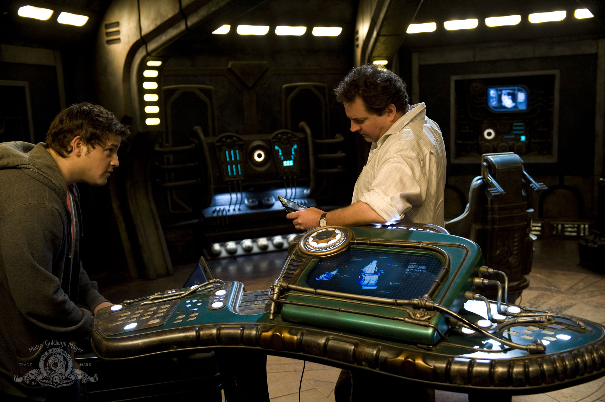

# STARGATE UNIVERSE: TECHNICAL MANUAL

**DESTINY EXPEDITION SHIP'S REFERENCE, FIRST EDITION**

*Third volume of the set, companion to the SG-1 and Atlantis Expedition References. Prepared in the tradition of the Star Trek Writers'/DS9 Technical Manuals: an in-universe reference consolidating broadcast canon, with clearly marked engineering extrapolation.*

---

## ABOUT THIS DOCUMENT

This manual provides the detailed technical background that stories aboard the Ancient ship *Destiny* sometimes need. It is a supplement to, not a replacement for, character, and this volume needs that warning most of all, because *Destiny*'s stories are people stories. The ship is a decaying coffin with a mission; the drama is who you become inside it.

**Edition pin.** This First Edition reflects status quo as of **the end of the expedition's recorded operations: all hands in stasis, ship on automated FTL toward the Signal's source** (see §1.5). Events after that point are not reflected here.

**Conventions used throughout:**

| Marker | Meaning |
|---|---|
| *(no marker)* | Established by on-screen canon as broadcast |
| **[E]** | Extrapolation — internally consistent engineering detail where the screen was silent. May be refined, never casually contradicted |
| **[W]** | Writer's latitude note — guidance on how hard this rule binds you |

Where this manual conflicts with a filmed episode, the episode wins. Log the conflict in Appendix C.

**Companion volumes:** Milky Way network doctrine (SG-1 Reference), Pegasus city systems and vessel specifications (Atlantis Reference).

**Structure:** Part One sets the theater between galaxies. Part Two is *Destiny* herself. Parts Three–Five cover gate operations, vessels, and equipment. Part Six is the threat dossier. Part Seven covers command legitimacy under strain. Part Eight catalogs phenomena. Appendices carry glossary, conversions, the canon log, and index.

---

## PART ONE: THE THEATER BETWEEN GALAXIES

### 1.0 Introduction

*Destiny* is fifty million years old, launched before humanity's ancestors had names, following a signal embedded in the cosmic microwave background toward an unknown destination. Her crew did not volunteer for her, they fled through her gate to survive an attack, and she jumped before anyone could leave. Every system in this manual should be read through that lens: no resupply, no rotation, no map home.

**In brief:** Where SGC builds and Atlantis inherits, the *Destiny* expedition *scavenges*. The ship predates scarcity as the Ancients experienced it; her crew live inside her decline.

### 1.1 The Strategic Situation

| Property | Value |
|---|---|
| Theater | Intergalactic void, course unknown — billions of light-years from Earth and receding |
| Command post | The Ancient ship *Destiny*, under way except for gate-stop intervals |
| Complement | ~80 survivors of Icarus Base plus absorbed Lucian Alliance prisoners **[E]** |
| Supply state | No resupply of any kind; every consumable is finite |
| Contact with home | Consciousness-swap stones only; no matter, no ships |

Three facts define every decision aboard:

1. **The ship is dying faster than the crew can fix it.** *Destiny* has run fifty million years past her maintenance life. Every system works until it doesn't, and nothing is replaceable, only cannibalized.
2. **The mission is not theirs.** The Signal predates humanity. The crew can follow it, ignore it, or die arguing about it; they cannot change it.
3. **Everyone left behind a body on Earth.** Stone-swappers wake in borrowed flesh; everyone else's family thinks whatever Homeworld tells them. Grief at this distance is administrated.

**[W]** SGU stories are pressure-cooker stories: the enemy is rarely the point. Scarcity, legitimacy, faith, and boredom-at-knife-point are the engines.

### 1.2 Consolidated Timeline

| Era | Event |
|---|---|
| ~50,000,000 years ago | Ancients launch seed ships across the cosmos, dropping stargates along planned routes; *Destiny* follows to study the Signal embedded in the cosmic microwave background — evidence of structure preceding the universe itself |
| Launch era → present | Ancients abandon the project over generations (Ascension, plague-era priorities). *Destiny* continues autonomously, seeding-gate to seeding-gate, decaying |
| 2009 CE | Icarus Project solves nine-chevron dialing via naquadria core resonance. Lucian Alliance attack destroys the base; survivors gate to *Destiny* mid-transit. Ship jumps immediately |
| Year 1 | Water crisis, air crisis, Lucian Alliance takeover attempt, first contact with the Nakai, discovery of the Bridge and Rush's master codes, Eden |
| Year 2 | Drone war escalates; Novus colony discovered (descendants of an alternate-timeline crew); Chloe's transformation resolved; command ship hub destroyed |
| End of record | Fleet engagement won at terrible cost; crew enters stasis; *Destiny* begins the long automated jump toward the Signal's origin **[W]** |

### 1.3 Assessment of Forces

*(Full dossiers in Part Six.)*

**The Expedition (~80 souls [E]).** A mixed bag of Icarus Base personnel, soldiers, scientists, civilians who were simply there when the base fell, plus a Lucian Alliance contingent absorbed after their takeover failed. No rotation exists. Command rests on Colonel Everett Young's shoulders and on everyone deciding, daily, to let it.

**The Drone Network.** Unmanned fighters coordinated by command ships, executing attack logic from a war whose principals are millions of years dead. They engage anything weapons-bearing; they do not negotiate because nothing is left to negotiate with. Their central hub's destruction slowed them but did not end them **[W]**.

**The Nakai.** A starfaring species competing for the same gates and resources, blue-skinned, telepathically gifted, technologically near-parity with Destiny. Withdrawn after heavy losses; withdrawal is not departure.

**Earth (distant).** Contactable only through Ancient communication stones swapping minds into bodies at Homeworld Command. Earth can send expertise, orders, and comfort; it cannot send food, fuel, or people. This asymmetry defines every conversation with home.

### 1.4 Founding Technologies

**In brief:** The expedition's toolkit is a fixed inheritance: one Ancient ship, her two shuttles, the kino fleet, communication stones to Earth, and whatever walked through the gate with eighty people on the worst day of their lives.

- **Communication stones:** paired devices swapping consciousness across any distance, the program's umbilical to Earth (§3.3).
- **Kinos:** floating spherical remotes, camera, intercom, scout, and the ship's de facto security system (§5.2).
- **The Ancient interface chair:** damaged; grants ship-system knowledge directly into the user's mind at risk of brain damage and worse (§2.2).
- **Salvaged weapons:** what the military carried plus Lucian Alliance arms after the takeover attempt (§5.1).

### 1.5 Status Quo Snapshot (Edition Pin: End of Recorded Operations)

| Domain | Status |
|---|---|
| Ship state | All hands in stasis; automated FTL under way toward the Signal's source — a crossing projected in years |
| Crew | ~80 in pods **[E]**; command succession pre-recorded for every contingency |
| Drone threat | Command-ship hub destroyed; residual fighters scattered but the class persists **[W]** |
| Nakai | Withdrawn after losses; intentions unknown |
| Earth link | Stones inactive during stasis crossing by design — waking bodies would starve without hands to feed them |
| The Signal | Unchanged. Waiting. |

**[W]** This pin is a suspended sentence, literally. Every post-pin story is a *waking*: something changed while they slept. That is the volume's standing invitation.

### 1.6 Icarus Base (Predecessor Installation)

**In brief:** The planetary research base whose destruction began the expedition: a fortified facility on an unnamed world, built around a naquadria core whose resonance signature could power a nine-chevron dial. The Lucian Alliance attack that cracked the core also forced the evacuation through *Destiny*, the attack and the discovery are the same event in the program's memory.

| Property | Value |
|---|---|
| Purpose | Nine-chevron dialing research (Icarus Project) |
| Power plant | Planetary naquadria vein, tapped by Ancient-designed resonance equipment |
| Complement | ~100 military/civilian **[E]**; ~80 survived to the ship |
| Fate | Core detonation destroyed the planet's surface viability; site abandoned |

**Why it matters:** every person aboard was selected or present because of naquadria physics, not exploration fitness. The expedition is a lab cohort that became a crew. Icarus-class sites remain the only known key to nine-chevron addresses, which means somewhere, someone is drilling again **[W]**.

---

## PART TWO: DESTINY

### 2.0 Ship Overview

**In brief:** *Destiny* is the oldest known operating vessel in existence, an Ancient long-range exploration ship launched ahead of her support infrastructure, built to be self-sufficient across geological time and to be repaired by no one. Her design assumes crewed maintenance she has never had; her decay is fifty million years of that assumption failing gracefully.

| Property | Value |
|---|---|
| Class | Ancient deep-space explorer (unique) |
| Launch era | ~50,000,000 years before present |
| Length | ~800 m **[E]** |
| Decks | 20+ sections in three hull zones **[E]** |
| Complement (designed) | Thousands **[E]**; current complement ~80 |
| Autonomy | Fully capable of unmanned operation; most systems run themselves until touched |
| Condition | Structurally sound; systems decaying non-uniformly — the ship's defining trait |

**Design language:** angular grey-green hull over an internal skeleton of corridors and shafts, lit sparsely by amber emergency lighting that is original equipment, not damage. Sections are designated by number; the bow hosts gate operations and the shuttle bays, the stern the FTL drive and engineering spine.

```
   DESTINY — PROFILE (schematic, not to scale)

    FRONT                                          STERN
   ____________
  /            \________________________
 | GATE ROOM   |  midship sections:     \______
 | [black gate] |  quarters · hydroponics       \_______
 | SHUTTLE BAYS |  infirmary · brig · labs              | FTL DRIVE
 |_____________|  kino dock · airlock                    | [star-scoop
        \        sealed/derelict sections ----####-------|  emitters]
         `---- bridge access (concealed) --------####-----'
   #### = sections lost to vacuum, sealed since arrival year
```

### 2.1 Structures and Zones

| Zone | Function | Condition |
|---|---|---|
| Bow / gate operations | The black stargate, kino dock, shuttle bays 1–3 (two shuttles survive **[E]**) | Active |
| Command deck ("the Bridge") | Master systems access — *concealed* until discovered mid-year-one; not on any crew-accessible map | Active, restricted |
| Midship habitat | Quarters, mess, hydroponics bay (crew-built from ship components) | Active |
| Medical bay | Ancient diagnostic beds; no regeneration fields — this ship predates them **[E]** | Active |
| Interface chamber | The damaged neural chair | Restricted |
| Engineering spine | FTL drive access, power distribution | Active, lethal when misused |
| Derelict sections | Vacuum-exposed, sealed; air and heat lost in the arrival year; some later reclaimed | Partial |

**[W]** Set geography: the gate room is the heart; the Bridge is the secret. Keep the walk between them long enough that controlling one is not controlling the other, the first season's politics live in exactly that gap.

### 2.2 Command Systems

**The Bridge.** Concealed behind a bulkhead requiring master codes; hosts the full-ship control interface. Its discovery mid-first-season restructured every power relationship aboard, whoever holds the Bridge holds the ship, and Rush held its keys alone for a time.


*Field reference: Ancient console interface, crystal keys, no readable labels until expedition overlays.*

**Master codes.** Rush's private override set, established via the interface chair. Command doctrine treats their existence as an open wound: legitimate command (Young) and technical access (Rush) remain permanently separate authorities. Every crisis since has been, at root, about whether those two things can be forced back together.

**The interface chair.** A neural knowledge-transfer device, damaged in transit, still functional at risk. It writes ship-system comprehension directly into a user's cortex. Known effects: total systems fluency; nosebleeds, seizures, personality drift with repeated use; one operator (Franklin) vanished entirely after a deep session, see §8.4. Use requires medical standing authorization and someone willing to say goodbye **[W]**.

### 2.3 Computer System

- Ship intelligence runs on distributed Lantean-era processing, largely autonomous, *Destiny* flies herself, repairs herself within limits, and gates ahead automatically.
- Human interfaces are limited: wall panels, kino feeds, the Bridge console. There is no general query language; the crew learned the ship like weather, by observation.
- The ship logs everything, including the crew. Privacy aboard *Destiny* is a social convention the hardware does not recognize **[W]**.

### 2.4 Power Generation

**In brief:** No fuel, no reactors to refuel: *Destiny* charges her capacitors directly from stars, diving shielded through stellar coronae on scheduled passes. Power state governs everything, FTL segments, life support margin, gate range, shield strength.

| Source | Notes |
|---|---|
| Star-scoop charging | Primary. Shielded corona dives recharge capacitors over hours; the maneuver is routine, spectacular, and never entirely safe — shields decayed mid-dive once, with casualties |
| Capacitor banks | Distributed through the engineering spine; degradation of individual banks produces the ship's characteristic brownouts |
| Auxiliary taps | Solar trickle while in normal space; negligible except for survival loads |

**Power discipline:** unlike every other volume in this set, there is no external supply line at all. A bank lost is a district dark forever; a star missed is an FTL delay measured in months. The expedition's calendar is written in stellar encounters.

### 2.5 Defensive Systems

**Shields.** Full-envelope Ancient shielding, powerful when charged, decaying with capacitor state. Fifty million years of micro-impacts have scarred the emitters; shield strength is the first thing power rationing touches and the last thing anyone wants it to touch.

**Armor and structure.** The hull has survived fifty millennia of dust at FTL speeds; against directed fire it performs like armor, not a forcefield. Sections sacrificed to vacuum are sealed, not mourned until later.

**Weapons.** Minimal by design: *Destiny* carries defensive batteries adequate to discourage fighters, nothing more. Her survival doctrine is flight, concealment (FTL signatures are hard to track), and repair, not engagement. The drone war was forced on her.

### 2.6 Propulsion

#### Faster-Than-Light Drive

**In brief:** *Destiny*'s FTL is not hyperspace. No subspace window, no gates, the ship translates directly across space in sustained acceleration segments that can run for days or years. It is faster than any hyperdrive known and effectively untrackable mid-segment.

| Property | Value |
|---|---|
| Transit character | Continuous translation; no "window" events |
| Speed | Exceeds all known hyperdrive classes **[E]** |
| Tracking | Mid-flight signature extremely faint — the ship's best defense |
| Limitations | Course set at segment start; power-hungry; drive stress accumulates without maintenance windows |

**[W]** FTL's story property: once the jump begins, nobody gets off. Every plot that needs an exit ramps one up before the countdown or waits for arrival.

#### Maneuvering

Sublight via distributed thruster arrays; agility poor by design, she was built to travel in straight lines between stars for decades at a stretch.

### 2.7 Sensors and Communications

- **Long-range sensors:** detect gates, ships, and stellar bodies across interstellar ranges; resolution degrades with distance and age.
- **Subspace communication:** ship-to-gate-network only within local range; no direct Earth link exists, stones bridge that gap (§3.3).
- **Kino network:** the crew's own ad hoc sensor grid, see §5.2.
- **The Signal:** the ship continuously monitors the cosmic microwave background pattern that is her mission. The instrument array dedicated to it occupies her forward section and answers to no one **[W]**.

### 2.8 Environmental and Life Support

The arrival year nearly killed everyone twice: CO2 scrubber cascade failure, then water contamination. Fixes since: hydroponics bay (crew-built), ice-mining runs through the gate, scrubber components cannibalized from derelict sections, strict airlock discipline after the sabotage incidents. Water and air are rationed by policy and audited by kino, the most-read documents aboard are the consumables ledger and the duty roster.

### 2.9 Medical Facilities

An Ancient diagnostic suite reading full biometrics, plus whatever pharmaceuticals eighty people carried through the gate. No sarcophagus, no regeneration fields, no resupply: the infirmary's supply cabinet is a countdown. Psychological casualties outnumber physical ones roughly three to one **[E]**, treat accordingly.

### 2.10 Emergency Operations

| Condition | Trigger | Response |
|---|---|---|
| Section breach | Micrometeorite, combat, decay | Auto-seal; evacuation through kino-mapped routes |
| Power emergency | Capacitor bank failure | District brownouts; life support priority locked |
| Hostile boarding | Drone/Nakai/Lucian Alliance | Marine response + kino surveillance net; airlock denial |
| Stasis contingency | Uninhabitable ship | Full crew to stasis pods; automated recovery protocols pre-staged — executed at the edition pin |

---

## PART THREE: GATE OPERATIONS

### 3.1 The Black Gate

**In brief:** *Destiny*'s stargate predates the Milky Way and Pegasus networks' common design: a black, unlit ring with a fixed glyph set, no DHD, and dialing handled entirely by the ship's own systems.

- **Auto-dial doctrine:** the ship gates to whatever world lies along her course when she drops from FTL; the window is short and scheduled by stellar encounter, not by human convenience. Missed windows mean waiting for the next planet.
- **No nine-chevron lockout:** Destiny's gate connects only within the seeded local network, the seed ships dropped gates along the route specifically so the mission could step ahead. Dialing backward toward known space is impossible without Icarus-class power.
- **Gate travel remains one-way, 38-minute limited** (companion SG-1 §3.1 applies for fundamentals).

### 3.2 Off-World Operations

Every gate run is a supply run: water, food, fuel-grade materials, or nothing. Doctrine (hard-won):

1. Kino through first, always.
2. Armed overwatch at the event horizon until recall.
3. Hard time-limit discipline: the ship will leave. She has left people behind. Both facts are canon and neither is negotiable.
4. Anything brought aboard quarantines through medical before joining general stores.

### 3.3 Communication Stones

**In brief:** Paired devices swapping consciousness between two bodies across any distance, the expedition's only link to Earth. A swapper's mind rides a willing participant's body at Homeworld Command while that person's mind occupies their body aboard *Destiny*.

Operational rules:

- Bodies must be maintained: sleeping, feeding, exercising the vacated flesh is someone's duty roster line.
- Identity discipline: stone-swapped personnel carry Earth authority into the ship's politics, Telford's dual role made him simultaneously liaison, spy, and hostage of both sides.
- The stones have been used for interrogation, courtship, court martial testimony, and last goodbyes. They are the most ethically loaded objects in three volumes **[W]**.

### 3.4 Kino Operations

The kino fleet doubles as the gate-recon drone: thrown through first, hovering, mapping, listening. Standard survey package per stop: atmosphere, life signs, resources, threats, recorded and archived automatically to the ship's logs. Losing a kino costs nothing but pride; they are the cheapest things aboard.

---

## PART FOUR: VESSELS

**Recognition reference:** see plate `Stargate Universe - Ship Recognition Plate.png` (companion file, this folder).

### 4.1 Ancient Vessels

#### Seed Ship (derelict)

**In brief:** One of the automated ships that preceded *Destiny*, seeding stargates along the mission corridor. Found derelict with a single surviving drone-class guardian; her gate stock explained the network's existence.

| Specification | Value |
|---|---|
| Length | ~500 m **[E]** |
| Complement | None (automated) |
| Role | Gate deployment, forward logistics |
| Status | Derelict; cannibalized for parts |

#### Shuttles

*Destiny* carries two surviving shuttlecraft (a third was lost **[E]**): small, shielded, FTL-*incapable*, system-range craft for gate-stop logistics and boarding actions. Each shuttle is a lifeboat, a gunship, and the crew's only independent hull; losing one measurably reduced the expedition's options.

| Specification | Value |
|---|---|
| Complement | Pilot + several passengers |
| Drive | Sublight only |
| Defense | Light shields; hull-rated for reentry |
| Role | Landing, salvage, evacuation, ramming if it comes to that |

### 4.2 Drone Network Vessels

**In brief:** The automated enemy: unmanned fighters swarming from carrier command ships, all executing attack logic from a hub world whose builders are long extinct. They engage anything weapons-bearing with perfect coordination and zero self-preservation.

| Class | Size | Role |
|---|---|---|
| Drone fighter | ~10 m **[E]** | Swarm attacker; green energy bolts; expendable by doctrine |
| Command ship | ~500 m **[E]** | Coordinates local fighter groups; shielded; the real target in any engagement |
| Mothership | Several km **[E]** | Strategic carrier and production node |

**Tactical notes:** fighters die easily individually and never individually. Killing the local command ship releases the swarm into confusion, the only kill-chain that works repeatedly. Destruction of the network's central hub (year two) degraded but did not disarm the class; dormant assets remain **[W]**.

**Origin:** their makers died in the war that birthed them; *Destiny* fought them before humanity existed and was still firing on her when the crew arrived. The crew inherited a fifty-million-year-old feud they never joined.

### 4.3 Nakai Vessels

Blue-armored warships of the Nakai species: hyperdrive-capable, shielded, crewed, near-parity with Destiny in a duel and willing to take losses the expedition cannot. Signature capability: abduction raids via short-range transporter-analog beams **[E]**. Withdrawn from the corridor after heavy losses in the drone war; their absence is unexplained and therefore temporary.

---

## PART FIVE: WEAPONS AND EQUIPMENT

### 5.1 Weapons

**In brief:** The expedition fights with what eighty people carried through one gate plus captured Lucian Alliance arms: a handful of P-90s and pistols, a few naquadah-enhanced grenades, Alliance energy rifles after the takeover attempt, and improvised anything.

- **Earth kit:** P-90s, sidearms, limited ammunition, every round is irreplaceable, so fire discipline is religious.
- **Lucian Alliance energy rifles:** post-takeover acquisitions; rechargeable cells make them the de facto standard arm.
- **Destiny's defensive batteries:** ship-scale, minimal, effective against fighters only (§2.5).
- **Improvised ordnance:** the engineering team's specialty, breaching charges, remote detonators, and at least one plan per season that should not have worked.

### 5.2 Kinos

The signature equipment of the volume: floating spherical remotes, camera, microphone, speaker, and light. Uses on record: gate recon, hull inspection, security surveillance, evidence collection (the airlock murder investigation), hostage negotiation, funeral broadcasts, and games. The kino net is the ship's nervous system extension; whoever controls kinos sees everything, which makes kino discipline a standing political issue **[W]**.

### 5.3 Field Equipment

- Communication stones (§3.3), stored under dual control.
- Ancient hand-scanners salvaged from ship stores.
- Water reclamation kits and ration packs: the true currency aboard.
- Duty rosters, consumables ledgers, and the stasis contingency file: paperwork as survival gear.

---

## PART SIX: THREAT DOSSIERS

### 6.0 The Drone Network

**In brief:** An automated war machine outliving its makers: fighters, command ships, motherships (§4.2) executing engagement logic against any armed vessel. They cannot be reasoned with because there is no one home to reason with, the closest thing to a ghost story in this set that is also real.

**Doctrine notes:**

- They escalate: first contact was a single scout; by year two, full fleet engagements.
- They ignore the unarmed, *Destiny* survived her earliest encounters by being too damaged to register as a priority target. That grace period ended.
- Hub destruction scattered them; scattered is not dead. Any post-pin waking should ask what fifty years of autonomous drift taught the machines.

### 6.1 The Nakai

A starfaring species of telepathic blue-skinned humanoids competing for the seeded corridor's resources, water worlds, gates, and (briefly) people. Capabilities on record: abduction raids, mind-probing of captives (Rush), and human augmentation experiments producing hybrid physiology in an abducted crew member (Chloe Armstrong, transformation reversed, scars psychological).

**Assessment:** near-peer adversaries who withdrew rather than face the drone war's winner. Their return is not a question of whether but of which season **[W]**.

### 6.2 The Lucian Alliance Contingent

The takeover faction that gated aboard during the incursion attempt ("Incursion" arc): soldiers and scientists under Kiva's command, absorbed into ship's company after their coup failed and both sides needed every pair of hands.

- **Integration status:** uneasy, permanent. Alliance members serve on duty rosters, sit in the mess, and remember being prisoners of war here.
- **Standing value:** energy weapons, hyperdrive engineering literacy, and the only people aboard who chose none of this and stayed anyway.
- **Risk:** command legitimacy disputes map directly onto the military/civilian/LA triangle; every factional crisis since has tried to recruit them.

**[W]** The LA contingent exists so that no conflict aboard is ever two-sided. Use accordingly.

### 6.3 Internal Fracture (the standing threat)

The honest dossier: the most dangerous force aboard *Destiny* has been *Destiny*'s complement.

- **Legitimacy gap:** Colonel Young commands; Rush holds master codes; civilian leadership (Wray) holds Earth's ear via stones. Three authorities, one air supply.
- **Precedents on record:** a failed mutiny, a marooning (Young left Rush on a planet; the ship came back for both), a murder investigation, election talk.
- **Mitigation:** shared labor, shared danger, and the slow alchemy of duty rosters turning strangers into a crew. It mostly works. "Mostly" is the drama budget **[W]**.

---

## PART SEVEN: COMMAND UNDER STRAIN

### 7.0 Chain of Command

```
Homeworld Command (Earth)      — stones-only liaison; no operational reach
        |
COLONEL EVERETT YOUNG          — expedition commander
        |
   +--------+------------------+
   |        |                   |
MILITARY  CIVILIAN COUNCIL    TECHNICAL AUTHORITY
(Marines,  (Wray et al.:       (Rush + engineering:
 security)  governance, morale) master codes, the Bridge)
   |
LUCIAN ALLIANCE DETACHMENT     — absorbed; loyalty conditional
```

**In brief:** This is the only volume in the set where the org chart is itself a contested document. Young's command rests on necessity and consent, not relief schedules; Rush's technical authority rests on being irreplaceable; the council's moral authority rests on Earth's mandate that nobody believes in when the air scrubbers fail.

**Doctrinal rules that emerged:**

1. Medical authority (TJ) outranks convenience.
2. Stones-to-Earth traffic runs through the commander, no private channels.
3. The Bridge requires dual presence: command plus technical. Neither goes alone. (Rule honored mostly in the breach; see §6.3.)
4. Stasis selection criteria were drafted, argued over, and signed before anyone entered a pod, the fairest thing this crew ever did was pre-commit to fairness while they still could.

---

## PART EIGHT: A VOID BESTIARY

*Phenomena of the intergalactic dark.*

### 8.0 The Signal

**What:** A pattern embedded in the cosmic microwave background, structure older than the universe it sits inside, pointing somewhere. *Destiny*'s entire mission is to follow it; her instruments read it continuously.
**Where:** Everywhere. It is in the floor of reality.
**Cost of contact:** Meaning. Everyone who studies it long enough starts believing something about it. The manual takes no position on what the Signal *is*, that is the last story this franchise gets to tell **[W]**.

### 8.1 Eden

**What:** A world encountered once, off-course and impossibly idyllic, temperate, fruiting, empty. Verified real by soil samples; unverified in origin. The leading theory: a gift or test by beings capable of building paradise, offered to a crew being ground down by their ship.
**Where:** Not where it was. The ship moved on; one crew member stayed behind by choice.
**Cost of contact:** Hope with no supply line. Those who saw Eden argue about it still.

### 8.2 Novus and the Descendants

**What:** An advanced human colony founded by *Destiny*'s own crew, from an alternate timeline in which the ship failed and they settled, married, built, and died for two thousand years before their descendants re-encountered the ship in the present.
**Where:** A gated world two thousand years downstream of a history that no longer happened.
**Cost of contact:** Grief with grandchildren attached. The colonists keep museums of their founders; the founders are alive, younger than their own statues.

### 8.3 Star-Diving

**What:** The routine hazard of charging: shielded corona passes through living stars. Shield decay mid-dive has caused casualties; dive windows are computed, not negotiated.
**Where:** Any stellar type on route; the hotter the star, the faster the charge.
**Cost of contact:** Measured in seconds of margin. Every dive is controlled catastrophe practice.

### 8.4 Franklin's Door

**What:** The interface chair's deepest session left one operator vanished, physically absent, plausibly merged with the ship's systems. The Bridge sometimes behaves as if someone is home.
**Where:** Wherever he is. The chair room smells of ozone when asked.
**Cost of contact:** Undefined by design. Treat all "the ship did it herself" events as potentially his handwriting **[W]**.

### 8.5 Alternate-Timeline Bleed

**What:** Twin-*Destiny* class events: wormhole anomalies near stars duplicating ships and crews, alternate histories leaving physical debris (and graves) in the primary timeline.
**Where:** Stellar proximity incidents; see also companion manuals' quantum mirror doctrine (SG-1 §8.3).
**Cost of contact:** Proof that other yous made other calls, and occasionally, that their consequences arrive in your mail.

### 8.6 Stasis Technology

**What:** Ancient pods suspending metabolism indefinitely; *Destiny* carries a full complement rated for multi-year crossings.
**Where:** Dedicated stasis deck; pods networked to automated recovery protocols.
**Cost of contact:** Time debt, everyone who sleeps pays in a universe that moved on without them. The pin-date crew are its current account holders.

---

## APPENDICES

### Appendix A: Glossary

| Term | Definition |
|---|---|
| Black gate | Destiny's pre-network stargate; ship-dialed, no DHD |
| Command ship | Drone-network carrier coordinating fighter swarms |
| Communication stones | Consciousness-swap devices linking Destiny and Earth |
| Drone fighters | Unmanned swarm craft of the extinct builders' war |
| FTL | Destiny's direct-translation drive; faster than hyperdrive, untrackable mid-flight |
| Hub | Central drone command world (destroyed) |
| Icarus Project | Naquadria-core nine-chevron dialing program that found Destiny |
| Kino | Floating spherical remote camera/monitor |
| Master codes | Rush's private override authority over ship systems |
| Nine-chevron address | Dial requiring planetary-scale power; reaches unique deep-space targets |
| Novus | Descendant colony from an alternate timeline |
| Seed ship | Automated gate-laying predecessor vessel |
| Signal, the | CMB pattern defining Destiny's mission |
| Star-scoop / diving | Shielded stellar corona charging maneuver |
| Stones | See communication stones |
| Stasis pods | Long-duration suspension system (executed at pin date) |

### Appendix B: Units and Travel Times

| Route | Method | Duration |
|---|---|---|
| Gate stop → next gate stop | Ship's schedule | Days–weeks between stellar encounters **[E]** |
| Interstellar crossing | FTL segment | Hours–days **[E]** |
| Intergalactic void crossing | Sustained FTL | Years — the pin-date jump is one |
| Destiny ↔ Earth (matter) | None available | N/A — stones only |
| Destiny ↔ Earth (minds) | Communication stones | Instant |

### Appendix C: Canon Discrepancy Log and Writer's Latitude

| Topic | On-screen variance | Manual ruling |
|---|---|---|
| Destiny length | Never stated | ~800 m **[E]** pin, consistent with shuttle/gate proportions |
| Shuttle count | Two seen, three implied | Ruled two surviving, one lost **[E]** (§4.1) |
| FTL vs. hyperspace speed | "Faster," never quantified | Qualitative ruling stands (§2.6); no numbers on screen |
| Drone hub destruction | Fleet degraded, not eliminated | Residual threat persists post-pin (§6.0) |
| Franklin's fate | Deliberately unresolved | Remains unresolved by ruling (§8.4) |
| The Signal's meaning | Never revealed | Never revealed by ruling — it is the franchise's sealed room (§8.0) |
| Nakai return | Left open | Open by ruling; withdrawal ≠ exit (§6.1) |
| Complement size | ~80 implied | Pinned ~80 **[E]** |
| Stone-swap ethics | Inconsistent oversight | §3.3 rules stand: dual control, commander's channel |
| Post-pin stories | None filmed | All are *wakings* — something changed while they slept (§1.5) |

**Writer's latitude principles:** identical to companion volumes, every miracle leaves a bill somewhere. Aboard Destiny the bills are paid in air, water, ammunition, trust, and time; the ledger is the story.

### Appendix D: Index

*Alphabetical; section numbers reference this manual.*

| Term | Ref |
|---|---|
| Alternate-timeline bleed | 8.5 |
| Bestiary (phenomena catalog) | Part Eight |
| Black gate | 3.1 |
| Bridge (concealed command deck) | 2.2 |
| Chain of command | 7.0 |
| Command legitimacy / internal fracture | 6.3 |
| Communication stones | 3.3 |
| Computer system | 2.3 |
| Discrepancy log | App. C |
| Drone network | 1.3, 4.2, 6.0 |
| Eden (faith planet) | 8.1 |
| Environmental systems | 2.8 |
| FTL drive | 2.6 |
| Founding technologies | 1.4 |
| Franklin's Door | 8.4 |
| Gate operations | 3.1–3.2 |
| Icarus Project | 1.2 |
| Interface chair | 2.2, 8.4 |
| Kino | 3.4, 5.2 |
| Lucian Alliance contingent | 6.2 |
| Master codes | 2.2 |
| Medical facilities | 2.9 |
| Nakai | 1.3, 4.3, 6.1 |
| Nine-chevron problem | 3.1 |
| Novus colony | 8.2 |
| Power generation (star-scoop) | 2.4 |
| Recognition plate (ship silhouettes) | Part Four intro |
| Seed ship | 4.1 |
| Sensors and communications | 2.7 |
| Shuttles | 4.1 |
| Signal, the | 8.0 |
| Stasis technology | 8.6 |
| Status quo snapshot (stasis) | 1.5 |
| Star-diving | 8.3 |
| Structures and zones | 2.1 |
| Timeline (consolidated) | 1.2 |
| Weapons | 2.5, 5.1 |

---

*End of manual. Corrections and canon conflicts to the Chief Engineer's watch log, Destiny engineering section, first one awake reads this.*

